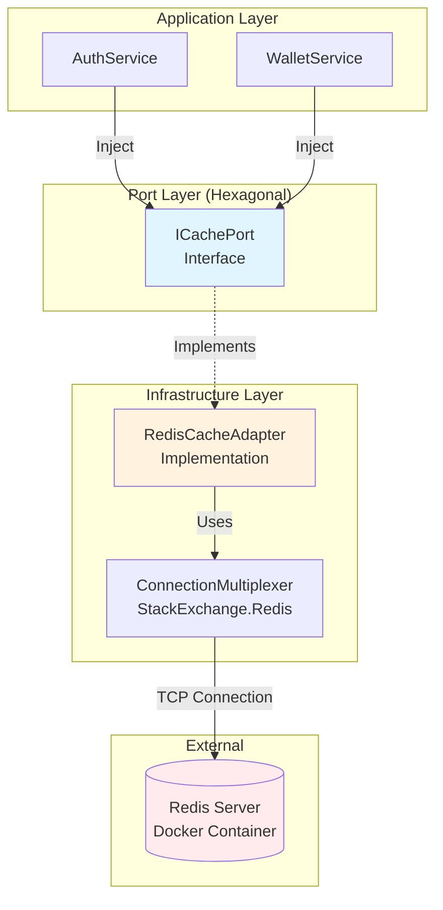
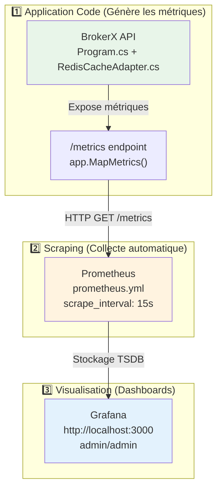
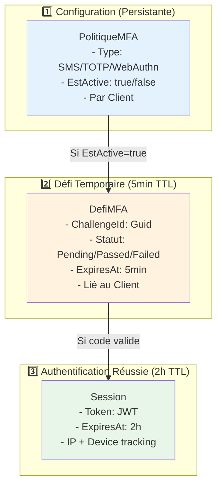
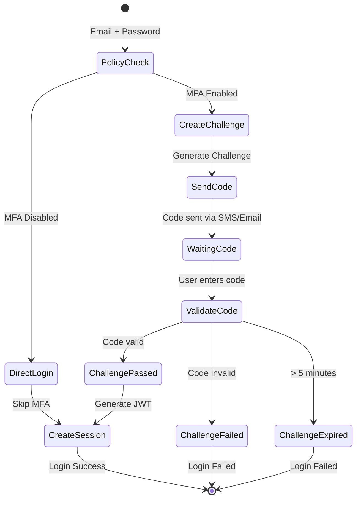
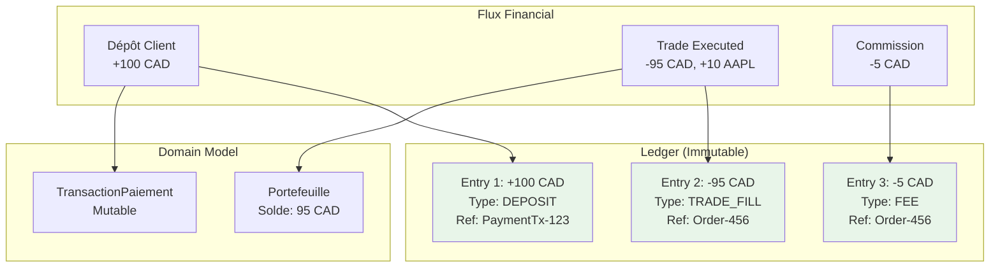

# 📋 Architecture du Projet BrokerX - Analyse Complète

## 🔍 Vue d'Ensemble du Projet

Ton projet **BrokerX** est une application .NET 8 qui implémente une plateforme de trading financier utilisant une **architecture hexagonale** (ports & adapters). Le projet est organisé en plusieurs couches avec une séparation claire des responsabilités.

---

## 🏗️ Structure des Couches

### 1. **Domain** (Cœur Métier) 🎯
**Localisation**: `src/Domain/`
**Rôle**: Le cœur de l'application, sans dépendances externes

#### Sous-modules:
```
Domain/
├── Model/
│   ├── Identite/          # Client.cs, Compte.cs, DossierKYC.cs
│   ├── Securite/          # Session.cs, PolitiqueMFA.cs
│   ├── PortefeuilleReglement/ # Portefeuille.cs, TransactionPaiement.cs
│   └── Observabilite/     # AuditLog.cs
├── Ports.Inbound/         # Interfaces des cas d'usage (ISignupUseCase, IAuthUseCase)
├── Ports.Outbound/        # Interfaces des repositories et services externes
└── Contracts/             # DTOs de retour (SignupResult, LoginResult)
```

**Principe**: Le Domain ne dépend de **RIEN**. Il définit les règles métier pures.

---

### 2. **Application** (Orchestration) 🎼
**Localisation**: `src/Application/`
**Rôle**: Services qui orchestrent les cas d'usage

```
Application/
├── Services/
│   ├── SignupService.cs   # Implémente ISignupUseCase
│   ├── AuthService.cs     # Implémente IAuthUseCase
│   └── WalletService.cs   # Implémente IDepositUseCase
└── DTOs/                  # (Si nécessaire, mais préfère Domain.Contracts)
```

**Principe**: Application → Domain (injection des ports Outbound)

---

### 3. **Infrastructure.Web** (API REST) 🌐
**Localisation**: `src/Infrastructure.Web/`
**Rôle**: Contrôleurs, DTOs d'API, point d'entrée web

```
Infrastructure.Web/
├── Controllers/
│   ├── SignupController.cs    # UC-01: POST /api/v1/signup
│   ├── AuthController.cs      # UC-02: POST /api/v1/auth/login
│   └── WalletController.cs    # UC-03: POST /api/v1/wallet/deposit
├── DTOs/
│   ├── SignupRequestDto.cs    # Validation + sérialisation JSON
│   ├── SignupResponseDto.cs
│   └── ...
├── Program.cs                 # Configuration DI + middlewares
└── Middleware/               # Gestion d'erreurs, auth
```

---

### 4. **Infrastructure.Persistence** (Base de Données) 💾
**Localisation**: `src/Infrastructure.Persistence/`
**Rôle**: Repositories, Entity Framework, migrations

```
Infrastructure.Persistence/
├── Repositories/
│   ├── InMemoryClientRepository.cs    # Implémente IClientRepository
│   ├── InMemoryAccountRepository.cs
│   └── BrokerXDbContext.cs           # EF Core DbContext
├── Migrations/                       # EF Core migrations
└── Configurations/                   # Configuration des entités EF
```

---

### 5. **Infrastructure.Adapters** (Services Externes) 🔌
**Localisation**: `src/Infrastructure.Adapters/`
**Rôle**: Implémentations des ports Outbound

```
Infrastructure.Adapters/
├── Otp/           # EmailSmsOtpAdapter.cs
├── Payment/       # PaymentAdapterSim.cs
├── Kyc/          # KycAdapterSim.cs
├── Session/      # JwtSessionAdapter.cs
├── Audit/        # StructuredAuditAdapter.cs
├── Ledger/       # SqlLedgerAdapter.cs
└── Cache/        # RedisCacheAdapter.cs
```

---

## 🔄 Flux de Données - Exemple UC-01 Signup

### 1. **Couche Web (Point d'entrée)**
```csharp
[HttpPost]
public async Task<ActionResult<SignupResponseDto>> Signup(
    [FromBody] SignupRequestDto dto,
    CancellationToken ct)
```

**Syntaxe expliquée**:
- `[HttpPost]`: Attribut de routage ASP.NET Core → cette méthode répond aux requêtes POST
- `[FromBody]`: Le DTO vient du body JSON de la requête HTTP
- `Task<ActionResult<T>>`: Pattern async/await + type de retour HTTP
- `CancellationToken`: Pour annuler les opérations longues

### 2. **DTOs - Pourquoi les utiliser ?**

#### **SignupRequestDto** (Infrastructure.Web/DTOs/)
```csharp
public sealed class SignupRequestDto
{
    [Required(ErrorMessage = "L'email est requis")]
    [EmailAddress(ErrorMessage = "Format d'email invalide")]
    public required string Email { get; init; }

    [StringLength(100, MinimumLength = 8)]
    [RegularExpression(@"^(?=.*[a-z])(?=.*[A-Z])(?=.*\d)(?=.*[@$!%*?&])",
        ErrorMessage = "Mot de passe doit contenir maj+min+chiffre+spécial")]
    public required string Password { get; init; }

    [Compare("Password")]
    public required string ConfirmPassword { get; init; }
    // ...
}
```

**Pourquoi les DTOs ?**
1. **Validation automatique**: Les attributs `[Required]`, `[EmailAddress]` valident automatiquement
2. **Sérialisation JSON**: ASP.NET Core convertit automatiquement JSON ↔ DTO
3. **Isolation**: Le domaine ne connaît pas les détails HTTP/JSON
4. **Versioning**: Tu peux changer l'API sans impacter le domaine
5. **Sécurité**: Contrôle précis de ce qui entre/sort de l'API

#### **SignupResponseDto** (Infrastructure.Web/DTOs/)
```csharp
public sealed class SignupResponseDto
{
    public required Guid ClientId { get; init; }
    public required Guid AccountId { get; init; }
    public required string Status { get; init; } // "Pending"/"Active"
}
```

**Syntaxe `{ get; init; }`**:
- `get`: Propriété en lecture seule publique
- `init`: Peut être définie uniquement lors de l'initialisation
- `required`: Obligatoire à l'initialisation (C# 11)
- `sealed class`: La classe ne peut pas être héritée

### 3. **Couche Application (Orchestration)**
Le contrôleur appelle le service:
```csharp
var result = await _signup.CreateAccountAsync(
    email: dto.Email,
    phone: dto.Phone,
    fullName: dto.FullName,
    password: dto.Password,
    birthDate: dto.BirthDate,
    ct: ct);
```

### 4. **Couche Domain (Logique Métier)**
Le service utilise les ports Outbound:
```csharp
public async Task<SignupResult> CreateAccountAsync(...)
{
    // 1. Créer l'entité Client (logique métier pure)
    var client = Client.CreerNouveauClient(...);
    
    // 2. Sauvegarder via le port Repository
    await _clients.AddAsync(client, ct);
    
    // 3. Déclencher KYC via le port externe
    await _kyc.OuvrirDossierAsync(client.ClientId, ...);
    
    // 4. Retourner le contrat du Domain
    return new SignupResult(client.ClientId, account.AccountId, "Pending");
}
```

### 5. **Couche Infrastructure (Implémentation des Ports)**
Les adapters implémentent les interfaces:
```csharp
public class InMemoryClientRepository : IClientRepository
{
    public async Task AddAsync(Client client, CancellationToken ct)
    {
        _db.Clients.Add(client);
        await _db.SaveChangesAsync(ct);
    }
}
```

---

## 🔴 Redis Cache - Architecture et Fonctionnement

Redis est intégré dans ton application BrokerX comme **cache distribué** pour améliorer les performances. Voici comment il fonctionne :

### **🏗️ Architecture Redis dans BrokerX**



### **⚙️ Configuration Redis - Program.cs**

#### **1. Chaîne de Connexion**
```csharp
// Configuration flexible (appsettings.json ou fallback)
var redisConnectionString = builder.Configuration["Redis:ConnectionString"] 
    ?? "localhost:6379,abortConnect=false";
```

#### **2. ConnectionMultiplexer (Singleton)**
```csharp
builder.Services.AddSingleton<IConnectionMultiplexer>(sp =>
{
    var configuration = ConfigurationOptions.Parse(redisConnectionString);
    configuration.AbortOnConnectFail = false; // ⭐ Graceful degradation
    
    Log.Information("🔌 Tentative connexion Redis...");
    var conn = ConnectionMultiplexer.Connect(configuration);
    Log.Information("✅ Redis connecté: {Endpoints}, Status: {IsConnected}", 
        string.Join(", ", conn.GetEndPoints()), conn.IsConnected);
    
    return conn;
});
```

#### **3. Cache Adapter (Singleton)**
```csharp
builder.Services.AddSingleton<ICachePort, RedisCacheAdapter>();
```

**Pourquoi Singleton ?**
- **ConnectionMultiplexer** est thread-safe et réutilisable
- **Performance** : Évite de recréer les connexions TCP
- **Pool de connexions** : Gère automatiquement les connexions internes

### **🔌 ICachePort - Interface du Domain**

Le Domain définit l'interface **sans dépendre de Redis** :

```csharp
public interface ICachePort
{
    // Operations CRUD de base
    Task<T?> GetAsync<T>(string key, CancellationToken ct = default) where T : class;
    Task SetAsync<T>(string key, T value, TimeSpan? ttl = null, CancellationToken ct = default) where T : class;
    Task RemoveAsync(string key, CancellationToken ct = default);
    Task<bool> ExistsAsync(string key, CancellationToken ct = default);
    
    // Operation avancée  
    Task RemoveByPatternAsync(string pattern, CancellationToken ct = default);
}
```

**Avantages Architecture Hexagonale** :
- ✅ **Testabilité** : Mock facile dans les tests
- ✅ **Flexibilité** : Peut changer Redis → Memcached → InMemory
- ✅ **Domain pur** : Pas de dépendance infrastructure

### **🛠️ RedisCacheAdapter - Implémentation**

#### **Fonctionnalités Avancées**
```csharp
public sealed class RedisCacheAdapter : ICachePort
{
    private readonly IConnectionMultiplexer _redis;
    private readonly IDatabase _db;
    private readonly JsonSerializerOptions _jsonOptions;
    
    // ⭐ Métriques Prometheus intégrées
    private static readonly Counter CacheOperations = Metrics.CreateCounter(
        "cache_operations_total", "Total cache operations by type",
        new[] { "operation", "key_prefix" });
    
    private static readonly Histogram CacheLatency = Metrics.CreateHistogram(
        "cache_operation_duration_seconds", "Cache operation latency");
}
```

#### **Pattern Get avec Mesures**
```csharp
public async Task<T?> GetAsync<T>(string key, CancellationToken ct = default) where T : class
{
    var sw = Stopwatch.StartNew();
    try
    {
        var value = await _db.StringGetAsync(key);
        sw.Stop();
        
        // ⭐ Métriques Prometheus
        CacheLatency.WithLabels("get").Observe(sw.Elapsed.TotalSeconds);
        
        if (value.IsNullOrEmpty)
        {
            CacheOperations.WithLabels("miss", GetKeyPrefix(key)).Inc();
            Log.Information("CACHE_MISS - Clé: {Key}, Durée: {ElapsedMs}ms", key, sw.ElapsedMilliseconds);
            return null;
        }

        var result = JsonSerializer.Deserialize<T>(value!, _jsonOptions);
        CacheOperations.WithLabels("hit", GetKeyPrefix(key)).Inc();
        Log.Information("CACHE_HIT - Clé: {Key}, Durée: {ElapsedMs}ms", key, sw.ElapsedMilliseconds);
        return result;
    }
    catch (Exception ex)
    {
        CacheOperations.WithLabels("error", GetKeyPrefix(key)).Inc();
        Log.Error(ex, "CACHE_ERROR - GetAsync échoué pour clé: {Key}", key);
        return null; // ⭐ Graceful degradation - ne pas casser l'app
    }
}
```

#### **Pattern Set avec TTL**
```csharp
public async Task SetAsync<T>(string key, T value, TimeSpan? ttl = null, CancellationToken ct = default)
{
    try
    {
        var json = JsonSerializer.Serialize(value, _jsonOptions);
        
        if (ttl.HasValue)
        {
            await _db.StringSetAsync(key, json, ttl.Value); // ⭐ Expiration automatique
        }
        else
        {
            await _db.StringSetAsync(key, json); // ⭐ Pas d'expiration
        }
        
        Log.Information("CACHE_SET - Clé: {Key}, TTL: {TTL}", key, 
            ttl?.TotalSeconds.ToString("F0") + "s" ?? "NONE");
    }
    catch (Exception ex)
    {
        Log.Error(ex, "CACHE_ERROR - SetAsync échoué pour clé: {Key}", key);
        // ⭐ Ne pas throw - graceful degradation
    }
}
```

### **💼 Utilisation dans les Services**

#### **WalletService - Cache des Portefeuilles**

```csharp
public sealed class WalletService : IDepositUseCase
{
    private readonly ICachePort _cache;
    
    // Pattern: Try Cache → DB → Set Cache
    private async Task<Portefeuille?> GetWalletWithCacheAsync(Guid accountId, CancellationToken ct)
    {
        var cacheKey = $"wallet:balance:{accountId}";
        
        // 1️⃣ Essayer le cache d'abord
        var cached = await _cache.GetAsync<Portefeuille>(cacheKey, ct);
        if (cached != null)
        {
            return cached; // ⚡ Cache hit - Rapide !
        }

        // 2️⃣ Cache miss - Récupérer depuis DB
        var wallet = await _wallets.GetByAccountIdAsync(accountId, ct);
        
        // 3️⃣ Mettre en cache si trouvé (TTL: 1 minute)
        if (wallet != null)
        {
            await _cache.SetAsync(cacheKey, wallet, TimeSpan.FromMinutes(1), ct);
        }

        return wallet;
    }
}
```

**Pattern Cache-Aside** :
1. **Cache Hit** → Retour immédiat (< 1ms)
2. **Cache Miss** → Base de données (10-50ms) + Mise en cache
3. **TTL 1 minute** → Balance entre fraîcheur et performance

#### **AuthService - Cache des Sessions (Prévu)**

```csharp
public sealed class AuthService : IAuthUseCase
{
    private readonly ICachePort _cache; // ⭐ Injecté mais pas encore utilisé
    
    // TODO: Implémenter cache des tokens JWT
    // Pattern: cache:session:{token} → Client info
}
```

### **🐳 Redis dans Docker Compose**

#### **Configuration docker-compose.yml**
```yaml
services:
  redis:
    container_name: brokerx-redis
    image: redis:7-alpine
    restart: unless-stopped
    command: redis-server --maxmemory 256mb --maxmemory-policy allkeys-lru
    # ⭐ Pas de port exposé - Réseau interne seulement
    healthcheck:
      test: ["CMD", "redis-cli", "ping"]
      interval: 10s
      timeout: 3s
      retries: 5
    networks:
      - brokerx-network
```

**Configuration Optimisée** :
- **256MB RAM max** : Limite mémoire pour éviter l'OOM
- **allkeys-lru** : Éviction LRU (Least Recently Used)
- **Health check** : Vérification automatique avec `redis-cli ping`
- **Réseau interne** : Sécurité - pas d'accès externe direct

#### **Connexion depuis l'App**
```csharp
// Connection string dans le réseau Docker
"redis:6379,abortConnect=false"
//  ↑
// Nom du service Docker = hostname
```

### **📊 Scraping des Données - Prometheus → Grafana (Observabilité)

Voici **exactement où** dans le code les données sont collectées et exposées pour Prometheus/Grafana :

### **🎯 Pipeline Complet : Code → Prometheus → Grafana**



### **1️⃣ Dans le Code - Où les Métriques sont Créées**

#### **A. Program.cs - Configuration Prometheus**

**Localisation** : `/src/Infrastructure.Web/Program.cs`

```csharp
// Ligne 15 - Import Prometheus
using Prometheus;

// Ligne 157 - Middleware automatique pour métriques HTTP
app.UseHttpMetrics(); // ⭐ Auto-collecte toutes les requêtes HTTP

// Ligne 174 - Endpoint d'exposition des métriques
app.MapMetrics(); // ⭐ Expose http://localhost:5000/metrics
```

**Ce que `UseHttpMetrics()` fait automatiquement** :
```
http_requests_total{method="POST",endpoint="/api/v1/signup",status_code="200"}
http_request_duration_seconds{method="POST",endpoint="/api/v1/signup"}
http_requests_in_progress{method="POST",endpoint="/api/v1/signup"}
```

#### **B. RedisCacheAdapter.cs - Métriques Métier Custom**

**Localisation** : `/src/Infrastructure.Adapters/Cache/RedisCacheAdapter.cs`

```csharp
// Lignes 22-28 - Création des métriques custom
private static readonly Counter CacheOperations = Metrics.CreateCounter(
    "cache_operations_total",  // ⭐ Nom de la métrique
    "Total cache operations by type and key prefix",
    new CounterConfiguration { LabelNames = new[] { "operation", "key_prefix" } });

private static readonly Histogram CacheLatency = Metrics.CreateHistogram(
    "cache_operation_duration_seconds", // ⭐ Nom de la métrique
    "Cache operation latency in seconds",
    new HistogramConfiguration { LabelNames = new[] { "operation" } });
```

#### **C. Utilisation des Métriques dans le Code**

```csharp
// Ligne 64-65 - Métrique Cache Hit
CacheOperations.WithLabels("hit", GetKeyPrefix(key)).Inc();

// Ligne 52 - Métrique Cache Miss  
CacheOperations.WithLabels("miss", GetKeyPrefix(key)).Inc();

// Ligne 48 - Métrique Latence
CacheLatency.WithLabels("get").Observe(sw.Elapsed.TotalSeconds);

// Ligne 91 - Métrique Cache Set
CacheOperations.WithLabels("set", GetKeyPrefix(key)).Inc();
```

### **2️⃣ Configuration Prometheus - prometheus.yml**

**Localisation** : `/prometheus.yml`

```yaml
# Ligne 6-7 - Fréquence de scraping
scrape_interval: 15s    # ⭐ Prometheus scrape toutes les 15 secondes
scrape_timeout: 10s

# Ligne 23-30 - Configuration du scraping BrokerX API
scrape_configs:
  - job_name: 'brokerx-api'
    scrape_interval: 15s
    metrics_path: '/metrics'  # ⭐ URL où récupérer les métriques
    scheme: 'http'
    static_configs:
      - targets: ['api:5000']  # ⭐ Adresse de l'API BrokerX
```

**Que fait Prometheus ?**
1. **Toutes les 15 secondes** → HTTP GET `http://api:5000/metrics`
2. **Parse les métriques** → Format Prometheus text
3. **Stocke en TSDB** → Time Series Database interne
4. **Expose via API** → Grafana peut requêter

### **3️⃣ Endpoint `/metrics` - Ce que Prometheus Scrape**

#### **URL d'accès direct**
```bash
# Voir les métriques en temps réel
curl http://localhost:5000/metrics
```

#### **Exemple de sortie `/metrics`**
```prometheus
# HELP http_requests_total The total number of HTTP requests.
# TYPE http_requests_total counter
http_requests_total{method="POST",endpoint="/api/v1/signup",status_code="200"} 42
http_requests_total{method="POST",endpoint="/api/v1/login",status_code="200"} 28
http_requests_total{method="GET",endpoint="/health",status_code="200"} 120

# HELP http_request_duration_seconds The HTTP request latencies in seconds.
# TYPE http_request_duration_seconds histogram
http_request_duration_seconds_bucket{method="POST",endpoint="/api/v1/signup",le="0.1"} 25
http_request_duration_seconds_bucket{method="POST",endpoint="/api/v1/signup",le="0.5"} 40
http_request_duration_seconds_bucket{method="POST",endpoint="/api/v1/signup",le="1.0"} 42

# HELP cache_operations_total Total cache operations by type and key prefix
# TYPE cache_operations_total counter
cache_operations_total{operation="hit",key_prefix="wallet"} 156
cache_operations_total{operation="miss",key_prefix="wallet"} 23
cache_operations_total{operation="set",key_prefix="wallet"} 23

# HELP cache_operation_duration_seconds Cache operation latency in seconds
# TYPE cache_operation_duration_seconds histogram
cache_operation_duration_seconds_bucket{operation="get",le="0.001"} 140
cache_operation_duration_seconds_bucket{operation="get",le="0.005"} 156
```

### **4️⃣ Configuration Grafana**

#### **Datasource Prometheus**
**Localisation** : `grafana/provisioning/datasources/` (à créer)

```yaml
# datasources.yml (à créer)
apiVersion: 1
datasources:
  - name: Prometheus
    type: prometheus
    url: http://prometheus:9090  # ⭐ URL interne Docker
    access: proxy
    isDefault: true
```

#### **Accès Grafana**
- **URL** : http://localhost:3000
- **Login** : admin / admin
- **Source de données** : Prometheus (http://prometheus:9090)

### **5️⃣ Docker Compose - Configuration Complète**

#### **Services Monitoring dans docker-compose.yml**

```yaml
# Lignes ~80-90 - Prometheus
prometheus:
  container_name: brokerx-prometheus
  image: prom/prometheus:latest
  ports:
    - "9090:9090"           # ⭐ Interface web Prometheus
  volumes:
    - ./prometheus.yml:/etc/prometheus/prometheus.yml:ro  # ⭐ Config
  networks:
    - brokerx-network
  depends_on:
    - api  # ⭐ Attend que l'API soit prête

# Lignes ~95-110 - Grafana  
grafana:
  container_name: brokerx-grafana
  image: grafana/grafana:latest
  ports:
    - "3000:3000"           # ⭐ Interface web Grafana
  volumes:
    - grafana_data:/var/lib/grafana
  environment:
    - GF_SECURITY_ADMIN_PASSWORD=admin  # ⭐ Password par défaut
  depends_on:
    - prometheus  # ⭐ Attend Prometheus
```

### **6️⃣ Métriques Disponibles par Défaut**

#### **A. Métriques HTTP Automatiques** (grâce à `UseHttpMetrics()`)

| **Métrique** | **Description** | **Labels** |
|--------------|-----------------|------------|
| `http_requests_total` | Nombre total de requêtes | `method`, `endpoint`, `status_code` |
| `http_request_duration_seconds` | Latence des requêtes | `method`, `endpoint` |
| `http_requests_in_progress` | Requêtes en cours | `method` |

#### **B. Métriques Cache Custom** (RedisCacheAdapter)

| **Métrique** | **Description** | **Labels** |
|--------------|-----------------|------------|
| `cache_operations_total` | Opérations cache (hit/miss/set) | `operation`, `key_prefix` |
| `cache_operation_duration_seconds` | Latence des opérations cache | `operation` |

#### **C. Métriques .NET Runtime** (automatiques)

| **Métrique** | **Description** |
|--------------|-----------------|
| `dotnet_total_memory_bytes` | Mémoire utilisée |
| `process_cpu_seconds_total` | CPU utilisé |
| `dotnet_gc_collections_total` | Garbage Collections |

### **7️⃣ Flux de Données en Temps Réel**

#### **Séquence de Scraping**
```
15:30:00 - Prometheus fait GET http://api:5000/metrics
15:30:00 - API retourne toutes les métriques actuelles
15:30:00 - Prometheus stocke dans TSDB avec timestamp
15:30:15 - Prometheus refait GET http://api:5000/metrics
15:30:15 - ...répète toutes les 15 secondes
```

#### **Exemple Concret - Cache Hit**
```csharp
// 1️⃣ Dans WalletService.GetWalletWithCacheAsync()
var cached = await _cache.GetAsync<Portefeuille>(cacheKey, ct);
if (cached != null) {
    // 2️⃣ RedisCacheAdapter.GetAsync() exécute:
    CacheOperations.WithLabels("hit", "wallet").Inc(); // ⭐ Compteur +1
    
    // 3️⃣ Prometheus scrape dans 15s max
    // 4️⃣ Grafana affiche le compteur mis à jour
}
```

### **8️⃣ Dashboards Grafana (À Créer)**

#### **Requêtes PromQL Utiles**

```promql
# Taux de requêtes par seconde
rate(http_requests_total[5m])

# Latence P95 des requêtes
histogram_quantile(0.95, rate(http_request_duration_seconds_bucket[5m]))

# Cache Hit Rate
rate(cache_operations_total{operation="hit"}[5m]) / 
rate(cache_operations_total[5m]) * 100

# Requêtes échouées (4xx, 5xx)
rate(http_requests_total{status_code=~"4..|5.."}[5m])
```

#### **Panels Recommandés**
- **Request Rate** : `rate(http_requests_total[5m])`
- **Error Rate** : `rate(http_requests_total{status_code=~"4..|5.."}[5m])`
- **Response Time P95** : `histogram_quantile(0.95, ...)`
- **Cache Hit Rate** : `cache_operations_total` ratio
- **Memory Usage** : `dotnet_total_memory_bytes`

### **9️⃣ Comment Tester le Scraping**

#### **Vérifier Prometheus Scrape**
```bash
# 1. Démarrer l'application
docker compose up -d

# 2. Vérifier l'endpoint metrics
curl http://localhost:5000/metrics

# 3. Vérifier Prometheus UI
open http://localhost:9090

# 4. Tester une requête PromQL
# Dans Prometheus UI → Graph → Expression:
http_requests_total
```

#### **Générer des Métriques**
```bash
# Faire des requêtes pour générer des métriques
curl -X POST http://localhost:5000/api/v1/signup \
  -H "Content-Type: application/json" \
  -d '{"email":"test@test.com","fullName":"Test User","password":"test123","confirmPassword":"test123"}'

# Vérifier les nouvelles métriques
curl http://localhost:5000/metrics | grep http_requests_total
```

### **🔟 URLs d'Accès Monitoring**

| **Service** | **URL** | **Usage** |
|-------------|---------|-----------|
| **BrokerX Metrics** | http://localhost:5000/metrics | Voir métriques raw |
| **Prometheus** | http://localhost:9090 | Interface Prometheus |
| **Grafana** | http://localhost:3000 | Dashboards (admin/admin) |
| **Health Check** | http://localhost:5000/health | Vérifier app vivante |

### **📈 Résumé - Pipeline de Données**

```
Code BrokerX → Métriques exposées /metrics 
    ↓ (scrape toutes les 15s)
Prometheus → Stockage TSDB
    ↓ (requêtes PromQL)
Grafana → Dashboards visuels
```

**Points clés** :
1. **`UseHttpMetrics()`** dans `Program.cs` → Métriques HTTP automatiques
2. **`Metrics.CreateCounter()`** dans `RedisCacheAdapter.cs` → Métriques métier
3. **`app.MapMetrics()`** → Endpoint `/metrics` exposé
4. **`prometheus.yml`** → Config scraping toutes les 15s
5. **Grafana** → Visualisation des données Prometheus

Toutes les données que tu vois dans Grafana viennent de ces 5 points ! 🚀

---

## 🔐 Système MFA (Multi-Factor Authentication) - Architecture Détaillée

Le système MFA dans `AuthService` utilise **3 entités Domain** qui travaillent ensemble pour sécuriser l'authentification. Voici comment ça fonctionne :

### **🏗️ Les 3 Composants MFA**



### **1️⃣ PolitiqueMFA - Configuration de Sécurité**

#### **Entité Domain**
```csharp
public sealed class PolitiqueMFA
{
    public Guid MfaId { get; }
    public Guid ClientId { get; }           // ⭐ 1 politique par client
    public TypeMfa Type { get; }            // SMS, TOTP, WebAuthn
    public bool EstActive { get; }          // ⭐ Active/Désactive le MFA
    public DateTimeOffset CreatedAt { get; }
}

public enum TypeMfa { Totp, Sms, WebAuthn }
```

#### **Objectif**
- **Configuration persistante** : Définit SI un client doit passer par MFA
- **Type de MFA** : SMS (code par email), TOTP (Google Authenticator), WebAuthn (biométrique)
- **Activation/Désactivation** : Permet de bypass le MFA temporairement

#### **Création Automatique**
```csharp
// SignupService.cs - Lors de l'inscription
var mfaPolicy = PolitiqueMFA.Creer(
    client.ClientId, 
    TypeMfa.Sms,    // ⭐ SMS par défaut (utilise système OTP existant)
    true            // ⭐ Activé par défaut pour tous les nouveaux clients
);
await _mfaPolicies.AddAsync(mfaPolicy, ct);
```

### **2️⃣ DefiMFA - Challenge Temporaire**

#### **Entité Domain**
```csharp
public sealed class DefiMFA
{
    public Guid ChallengeId { get; }        // ⭐ ID unique du défi
    public Guid ClientId { get; }           // Client qui doit résoudre le défi
    public TypeMfa Type { get; }            // Type de défi (SMS/TOTP/WebAuthn)
    public StatutDefi Statut { get; }       // Pending → Passed/Failed/Expired
    public DateTimeOffset CreatedAt { get; }
    public DateTimeOffset ExpiresAt { get; } // ⭐ TTL: 5 minutes
    public DateTimeOffset? CompletedAt { get; }
}

public enum StatutDefi { Pending, Passed, Failed, Expired }
```

#### **Cycle de Vie d'un Challenge**
```csharp
// 1. Création du défi (5min TTL)
var challenge = DefiMFA.Demarrer(client.ClientId, TypeMfa.Sms, TimeSpan.FromMinutes(5));

// 2. Validation réussie
challenge.Reussir(); // Statut: Pending → Passed

// 3. Ou échec
challenge.Echouer(); // Statut: Pending → Failed

// 4. Ou expiration automatique
if (DateTime.UtcNow > challenge.ExpiresAt) 
    // Statut: Pending → Expired
```

#### **Objectif**
- **Défi temporaire** : Valide UN SEUL login (usage unique)
- **Sécurité** : Expire automatiquement après 5 minutes
- **Traçabilité** : Audit de chaque tentative MFA

### **3️⃣ Session - Authentification Réussie**

#### **Entité Domain**
```csharp
public sealed class Session
{
    public Guid SessionId { get; }
    public Guid ClientId { get; }
    public TypeJeton TokenType { get; }     // JWT ou Opaque
    public string Token { get; }            // Token généré
    public DateTimeOffset IssuedAt { get; }
    public DateTimeOffset ExpiresAt { get; } // ⭐ TTL: 2 heures
    public string? Ip { get; }              // ⭐ Tracking IP
    public string? Device { get; }          // ⭐ Tracking Device
    public bool Revoked { get; }            // Révocation manuelle
}
```

#### **Objectif**
- **Token d'accès** : JWT valide pour accéder aux API protégées
- **Durée longue** : 2h (vs 5min pour le challenge)
- **Tracking** : IP et device pour sécurité
- **Révocation** : Possibilité de logout forcé

### **🔄 Flux Complet MFA - Cas d'Usage**

#### **Scénario 1 : Login Sans MFA (MFA désactivé)**
```csharp
// AuthService.LoginAsync()
var client = await _clients.GetByEmailAsync(email, ct);
var policy = await _mfaPolicies.GetByClientIdAsync(client.ClientId, ct);

if (policy == null || !policy.EstActive) {
    // ⭐ Pas de MFA requis → Session directe
    var session = Session.Creer(client.ClientId, TypeJeton.Jwt, token, TimeSpan.FromHours(2));
    var token = await _sessionPort.IssueAsync(session, ct);
    
    return new LoginResult(Token: token, MfaRequired: false);
}
```

#### **Scénario 2 : Login Avec MFA (MFA activé)**
```csharp
// AuthService.LoginAsync()
if (policy.EstActive && !bypassMfa) {
    // 1️⃣ Créer le challenge temporaire
    var challenge = DefiMFA.Demarrer(client.ClientId, policy.Type, TimeSpan.FromMinutes(5));
    await _mfaChallenges.AddAsync(challenge, ct);
    
    // 2️⃣ Envoyer le code (SMS/Email)
    var code = GenererCode6(); // "123456"
    await _otp.SendContactOtpAsync(client.ClientId, challenge.ChallengeId, 
        CanalOTP.Email, email, code, ct);
    
    // 3️⃣ Retourner l'ID du challenge (pas de token encore)
    return new LoginResult(Token: string.Empty, MfaRequired: true, 
        ClientId: client.ClientId, ChallengeId: challenge.ChallengeId);
}
```

#### **Scénario 3 : Validation MFA**
```csharp
// AuthService.VerifyMfaAsync()
public async Task<LoginResult> VerifyMfaAsync(Guid clientId, Guid challengeId, string code, CancellationToken ct)
{
    // 1️⃣ Récupérer le challenge (avec cache Redis)
    var cacheKey = $"mfa:challenge:{challengeId}";
    var challenge = await _cache.GetAsync<DefiMFA>(cacheKey, ct);
    
    if (challenge == null) {
        challenge = await _mfaChallenges.GetByIdAsync(challengeId, ct);
        await _cache.SetAsync(cacheKey, challenge, TimeSpan.FromMinutes(5), ct);
    }
    
    // 2️⃣ Valider le code (logique simplifiée pour démo)
    challenge.Reussir(); // Marquer comme réussi
    await _mfaChallenges.UpdateAsync(challenge, ct);
    
    // 3️⃣ Créer la session finale (token valide 2h)
    var session = Session.Creer(clientId, TypeJeton.Jwt, token, TimeSpan.FromHours(2));
    await _sessions.AddAsync(session, ct);
    var token = await _sessionPort.IssueAsync(session, ct);
    
    // 4️⃣ Cache la session pour validation rapide
    await _cache.SetAsync($"session:{session.SessionId}", session, TimeSpan.FromHours(2), ct);
    
    return new LoginResult(Token: token, MfaRequired: false);
}
```

### **📊 États et Transitions**



### **🔧 Optimisations Redis**

#### **Cache des Challenges MFA**
```csharp
// VerifyMfaAsync() - Pattern Cache-Aside
var cacheKey = $"mfa:challenge:{challengeId}";

// Try cache first
var challenge = await _cache.GetAsync<DefiMFA>(cacheKey, ct);
if (challenge != null) return challenge; // ⚡ Cache hit

// Cache miss - DB lookup
challenge = await _mfaChallenges.GetByIdAsync(challengeId, ct);
await _cache.SetAsync(cacheKey, challenge, TimeSpan.FromMinutes(5), ct); // TTL = Challenge TTL
```

#### **Cache des Sessions**
```csharp
// Après validation MFA réussie
var sessionCacheKey = $"session:{session.SessionId}";
await _cache.SetAsync(sessionCacheKey, session, TimeSpan.FromHours(2), ct); // TTL = Session TTL
```

**Bénéfices** :
- ⚡ **Validation rapide** : Session lookup 1ms (cache) vs 50ms (DB)
- 🔄 **Load balancing** : Sessions partagées entre instances API
- ♻️ **Auto-cleanup** : TTL Redis nettoie automatiquement

### **🛡️ Sécurité et Edge Cases**

#### **1. Bypass MFA (Développement)**
```csharp
// Mode développement - bypass via IP/Device
bool bypassMfa = ip?.Contains("bypass") == true || device?.Contains("bypass") == true;

// Exemple d'usage:
// POST /login { email: "test@test.com", password: "test123" }
// Headers: X-Forwarded-For: "192.168.1.1-bypass", User-Agent: "TestClient-bypass"
```

#### **2. Expiration Automatique**
```csharp
// DefiMFA.Reussir() - Vérification expiration
if (DateTimeOffset.UtcNow > ExpiresAt) {
    Statut = StatutDefi.Expired;
    throw new InvalidOperationException("Défi expiré.");
}
```

#### **3. Invalidation Cache**
```csharp
// Après validation, invalider le challenge
await _cache.RemoveAsync($"mfa:challenge:{challengeId}", ct);
```

### **📋 Clés Redis Utilisées**

| **Pattern** | **Exemple** | **TTL** | **Usage** |
|-------------|-------------|---------|-----------|
| `mfa:challenge:{challengeId}` | `mfa:challenge:abc-123` | 5 min | Cache du défi MFA |
| `session:{sessionId}` | `session:def-456` | 2 h | Session après login |
| `mfa:policy:{clientId}` | `mfa:policy:ghi-789` | 30 min | Politique MFA (futur) |

### **🎯 Pourquoi 3 Composants Séparés ?**

#### **1. PolitiqueMFA = Configuration Long Terme**
- **Durée** : Persistante (années)
- **Scope** : Configuration globale du client
- **Mutabilité** : Admin peut activer/désactiver
- **Exemple** : "Alice doit toujours passer par SMS MFA"

#### **2. DefiMFA = Challenge Temporaire**  
- **Durée** : Très courte (5 minutes)
- **Scope** : Une seule tentative de login
- **Immutabilité** : Usage unique, puis archivé
- **Exemple** : "Challenge 123 pour Alice expire à 14h05"

#### **3. Session = Token d'Accès**
- **Durée** : Moyenne (2 heures) 
- **Scope** : Accès aux APIs protégées
- **Révocabilité** : Logout, changement password
- **Exemple** : "Alice peut accéder aux APIs jusqu'à 16h00"

### **📊 Audit et Traçabilité**

#### **Événements Audités**
```csharp
// Logs d'audit pour compliance
await _audit.WriteAsync(AuditLog.Ecrire("AUTH_MFA_CHALLENGE", "user:" + email,
    payload: new { clientId, challengeId, policyType = policy.Type.ToString() }), ct);

await _audit.WriteAsync(AuditLog.Ecrire("AUTH_MFA_PASSED", "system",
    payload: new { clientId, challengeId, sessionId }), ct);
```

#### **Types d'Événements MFA**
- `AUTH_MFA_CHALLENGE` : Défi MFA créé
- `AUTH_MFA_PASSED` : Défi MFA réussi  
- `AUTH_MFA_FAILED` : Défi MFA échoué
- `AUTH_MFA_EXPIRED` : Défi MFA expiré
- `AUTH_LOGIN` : Login réussi (avec ou sans MFA)

### **🚀 Résumé - Flux MFA Complet**

```
1. Login(email, password)
   ↓
2. Vérifier PolitiqueMFA.EstActive
   ↓ (Si MFA requis)
3. Créer DefiMFA (5min TTL)
   ↓
4. Envoyer code SMS/Email
   ↓
5. VerifyMfa(challengeId, code)
   ↓ (Si code valide)
6. Marquer DefiMFA.Reussir()
   ↓
7. Créer Session (2h TTL)
   ↓
8. Générer JWT Token
   ↓
9. Cache Session + Return Token
```

**Le système MFA est donc conçu en 3 couches** :
- **Policy** : Règle de sécurité persistante
- **Challenge** : Défi temporaire et usage unique  
- **Session** : Token d'accès après validation

Cette séparation permet **flexibilité**, **sécurité** et **audit** complets ! 🔐

---

## 📚 FileLedgerAdapter - Journal Comptable (Ledger)

Le `FileLedgerAdapter` est l'implémentation du **journal comptable** de BrokerX. Il enregistre toutes les **écritures comptables** (movements d'argent) de manière **immutable** et **auditable**.

### **🎯 Rôle et Objectif**

#### **Qu'est-ce qu'un Ledger ?**
Un **Ledger** (journal comptable) est un **enregistrement chronologique immutable** de toutes les transactions financières. Dans une plateforme financière comme BrokerX, c'est **obligatoire** pour :
- **Conformité réglementaire** : Traçabilité complète des flux financiers
- **Audit comptable** : Justifier chaque centime qui entre/sort
- **Réconciliation** : Vérifier que les soldes sont corrects
- **Détection de fraude** : Analyser les patterns suspects



### **🏗️ Architecture Hexagonale**

```csharp
// Domain Port (Interface)
public interface ILedgerPort
{
    Task AddAsync(EcritureLedger entry, CancellationToken ct = default);
    Task AddRangeAsync(IEnumerable<EcritureLedger> entries, CancellationToken ct = default);
}

// Infrastructure Adapter (Implémentation fichier)
public sealed class FileLedgerAdapter : ILedgerPort
{
    private readonly string _filePath = "logs/ledger.jsonl"; // ⭐ Fichier JSONL
}
```

**Avantages architecture hexagonale** :
- ✅ **Testabilité** : Mock `ILedgerPort` dans les tests
- ✅ **Flexibilité** : Peut changer vers base de données, blockchain, etc.
- ✅ **Domain pur** : Le métier ne connaît pas le stockage

### **💾 Entité Domain : EcritureLedger**

```csharp
public sealed class EcritureLedger
{
    public Guid LedgerEntryId { get; }     // ID unique de l'écriture
    public Guid AccountId { get; }         // Compte concerné
    public decimal Amount { get; }         // Montant (peut être négatif)
    public string Currency { get; }        // Devise (CAD, USD, EUR)
    public TypeEcriture Kind { get; }      // Type d'écriture
    public TypeReference RefType { get; }  // Type de référence
    public Guid RefId { get; }            // ID de la transaction source
    public DateTimeOffset CreatedAt { get; } // Timestamp immutable
}

// Types d'écritures supportés
public enum TypeEcriture { 
    DEPOSIT,        // Dépôt d'argent
    TRADE_FILL,     // Exécution d'ordre (achat/vente)
    FEE,           // Commission/frais
    ADJUSTMENT     // Ajustement manuel
}

// Types de références
public enum TypeReference { 
    PAYMENT_TX,    // Lié à une TransactionPaiement
    EXECUTION,     // Lié à une exécution d'ordre
    ORDER,         // Lié à un ordre
    OTHER          // Autre
}
```

### **📝 Implémentation FileLedgerAdapter**

#### **Configuration dans Program.cs**
```csharp
// Program.cs ligne 101 - Singleton pour cohérence
builder.Services.AddSingleton<ILedgerPort>(
    new FileLedgerAdapter("logs/ledger.jsonl")); // ⭐ Fichier dédié ledger
```

#### **Stockage JSONL (JSON Lines)**
```csharp
public async Task AddAsync(EcritureLedger entry, CancellationToken ct = default)
{
    // Sérialisation JSON compacte (pas d'indentation)
    var line = JsonSerializer.Serialize(new {
        entry.LedgerEntryId, 
        entry.AccountId, 
        entry.Amount, 
        entry.Currency,
        Kind = entry.Kind.ToString(),      // Enum → String
        RefType = entry.RefType.ToString(), // Enum → String
        entry.RefId, 
        entry.CreatedAt
    }, _json);
    
    // Ajout atomique à la fin du fichier
    await File.AppendAllTextAsync(_filePath, line + Environment.NewLine, ct);
}
```

**Format JSONL** (une ligne JSON par écriture) :
```json
{"LedgerEntryId":"abc-123","AccountId":"def-456","Amount":100.00,"Currency":"CAD","Kind":"DEPOSIT","RefType":"PAYMENT_TX","RefId":"ghi-789","CreatedAt":"2025-12-03T10:30:00Z"}
{"LedgerEntryId":"abc-124","AccountId":"def-456","Amount":-95.00,"Currency":"CAD","Kind":"TRADE_FILL","RefType":"ORDER","RefId":"jkl-012","CreatedAt":"2025-12-03T10:35:00Z"}
{"LedgerEntryId":"abc-125","AccountId":"def-456","Amount":-5.00,"Currency":"CAD","Kind":"FEE","RefType":"ORDER","RefId":"jkl-012","CreatedAt":"2025-12-03T10:35:00Z"}
```

### **💼 Utilisation dans WalletService**

#### **Injection de Dépendance**
```csharp
public sealed class WalletService : IDepositUseCase
{
    private readonly ILedgerPort _ledger; // ⭐ Injecté

    public WalletService(
        IPayTxRepository paytx,
        IPortfolioRepository wallets,
        ILedgerPort ledger,        // ⭐ Port Outbound
        // ... autres dépendances
    ) {
        _ledger = ledger;
    }
}
```

#### **Écriture Ledger lors d'un Dépôt**
```csharp
// WalletService.OnSettlementAsync() - Ligne ~89
public async Task OnSettlementAsync(Guid paymentTxId, string status, CancellationToken ct)
{
    var tx = await _paytx.GetByIdAsync(paymentTxId, ct);
    var wallet = await _wallets.GetByAccountIdAsync(tx.AccountId, ct);

    if (status.Equals("Settled", StringComparison.OrdinalIgnoreCase))
    {
        // 1️⃣ Marquer la transaction comme réglée
        tx.MarquerReglee();
        
        // 2️⃣ Créditer le portefeuille (état mutable)
        wallet.Crediter(tx.Amount, tx.Currency);
        await _wallets.UpdateAsync(wallet, ct);
        
        // 3️⃣ ⭐ Enregistrer dans le ledger (immutable)
        var entry = EcritureLedger.PourDepot(
            tx.AccountId,    // Compte crédité
            tx.Amount,       // +100.00 CAD
            tx.Currency,     // CAD
            tx.PaymentTxId   // Référence vers PaymentTx
        );
        await _ledger.AddAsync(entry, ct); // ⭐ Écriture ledger
        
        // 4️⃣ Audit pour compliance
        await _audit.WriteAsync(AuditLog.Ecrire("DEPOSIT_SETTLED", ...));
    }
}
```

### **🔍 Factory Methods - Création d'Écritures**

#### **Dépôt d'Argent**
```csharp
// EcritureLedger.cs
public static EcritureLedger PourDepot(Guid accountId, decimal amount, string currency, Guid paymentTxId)
    => new(Guid.NewGuid(), accountId, amount, currency, 
           TypeEcriture.DEPOSIT, TypeReference.PAYMENT_TX, paymentTxId);

// Usage: +100.00 CAD crédité sur le compte
var entry = EcritureLedger.PourDepot(accountId, 100.00m, "CAD", paymentTxId);
```

#### **Ajustement Manuel**
```csharp
public static EcritureLedger PourAjustement(Guid accountId, decimal amount, string currency, string reason)
    => new(Guid.NewGuid(), accountId, amount, currency,
           TypeEcriture.ADJUSTMENT, TypeReference.OTHER, Guid.NewGuid());

// Usage: -10.00 CAD débité pour correction
var entry = EcritureLedger.PourAjustement(accountId, -10.00m, "CAD", "Correction erreur système");
```

#### **Trading (Futur - UC-05)**
```csharp
// À implémenter pour UC-05
public static EcritureLedger PourTrade(Guid accountId, decimal amount, string currency, Guid executionId)
    => new(Guid.NewGuid(), accountId, amount, currency,
           TypeEcriture.TRADE_FILL, TypeReference.EXECUTION, executionId);

// Usage trading:
// Achat 10 actions AAPL à 150$ = -1500 USD
var debitEntry = EcritureLedger.PourTrade(accountId, -1500.00m, "USD", executionId);
// Commission = -5 USD  
var feeEntry = EcritureLedger.PourFee(accountId, -5.00m, "USD", executionId);
```

### **📁 Structure des Fichiers Logs**

```
Infrastructure.Web/logs/
├── app-20251203.jsonl       # ⭐ Serilog - Logs techniques
├── audit.jsonl              # ⭐ Audit Log - Événements métier
└── ledger.jsonl             # ⭐ FileLedgerAdapter - Journal comptable
```

**Différences importantes** :

| **Fichier** | **Contenu** | **Durée Rétention** | **Usage** |
|-------------|-------------|---------------------|-----------|
| `app-*.jsonl` | Logs techniques, debug, performance | 7 jours | Développeurs |
| `audit.jsonl` | Événements métier critiques | **Années** | Auditeurs, compliance |
| `ledger.jsonl` | **Écritures comptables SEULEMENT** | **10+ années** | Comptabilité, régulateurs |

### **💰 Exemples d'Écritures Ledger**

#### **Scénario : Alice dépose 100 CAD puis achète AAPL**

```json
// 1️⃣ Dépôt initial +100 CAD
{
  "LedgerEntryId": "entry-001",
  "AccountId": "alice-account",
  "Amount": 100.00,
  "Currency": "CAD", 
  "Kind": "DEPOSIT",
  "RefType": "PAYMENT_TX",
  "RefId": "payment-tx-123",
  "CreatedAt": "2025-12-03T10:00:00Z"
}

// 2️⃣ Achat 1 action AAPL à 95 CAD
{
  "LedgerEntryId": "entry-002", 
  "AccountId": "alice-account",
  "Amount": -95.00,
  "Currency": "CAD",
  "Kind": "TRADE_FILL",
  "RefType": "EXECUTION", 
  "RefId": "execution-456",
  "CreatedAt": "2025-12-03T10:15:00Z"
}

// 3️⃣ Commission de trading
{
  "LedgerEntryId": "entry-003",
  "AccountId": "alice-account", 
  "Amount": -5.00,
  "Currency": "CAD",
  "Kind": "FEE",
  "RefType": "EXECUTION",
  "RefId": "execution-456", 
  "CreatedAt": "2025-12-03T10:15:00Z"
}

// Solde final Alice: 100 - 95 - 5 = 0 CAD + 1 AAPL
```

### **🔒 Propriétés du Ledger**

#### **1. Immutabilité**
```csharp
// ❌ Pas de méthode UPDATE ou DELETE
// ✅ Seulement ADD (append-only)
Task AddAsync(EcritureLedger entry, CancellationToken ct = default);
```

#### **2. Atomicité**
```csharp
// Écriture atomique dans le fichier
await File.AppendAllTextAsync(_filePath, line + Environment.NewLine, ct);
```

#### **3. Chronologie**
```csharp
public DateTimeOffset CreatedAt { get; } // ⭐ Timestamp à la création
```

#### **4. Traçabilité**
```csharp
public Guid RefId { get; }            // ⭐ Lien vers transaction source
public TypeReference RefType { get; } // ⭐ Type de référence
```

### **🧪 Tests et Validation**

#### **Mock dans les Tests**
```csharp
// WalletServiceTests.cs
private readonly Mock<ILedgerPort> _mockLedgerPort;

[Test]
public async Task OnSettlement_ShouldWriteLedgerEntry()
{
    // Arrange
    var paymentTxId = Guid.NewGuid();
    
    // Act  
    await _walletService.OnSettlementAsync(paymentTxId, "Settled");
    
    // Assert
    _mockLedgerPort.Verify(x => x.AddAsync(
        It.Is<EcritureLedger>(e => 
            e.Kind == TypeEcriture.DEPOSIT && 
            e.Amount == 100.00m)), 
        Times.Once);
}
```

#### **Validation Fichier Ledger**
```bash
# Voir les écritures en temps réel
tail -f Infrastructure.Web/logs/ledger.jsonl

# Compter les écritures par type
grep '"Kind":"DEPOSIT"' Infrastructure.Web/logs/ledger.jsonl | wc -l
grep '"Kind":"TRADE_FILL"' Infrastructure.Web/logs/ledger.jsonl | wc -l

# Calculer solde d'un compte
grep '"AccountId":"alice-account"' Infrastructure.Web/logs/ledger.jsonl | \
  jq '.Amount' | paste -sd+ | bc
```

### **🚀 Évolutions Production**

#### **Phase Actuelle - Développement**
```csharp
// Simple fichier JSONL
builder.Services.AddSingleton<ILedgerPort>(
    new FileLedgerAdapter("logs/ledger.jsonl"));
```

#### **Phase Production - Recommandée**
```csharp
// Base de données dédiée avec partitioning
builder.Services.AddScoped<ILedgerPort, SqlLedgerAdapter>();
// ou
// Event sourcing pour immutabilité garantie
builder.Services.AddScoped<ILedgerPort, EventStoreLedgerAdapter>();
// ou  
// Blockchain pour auditabilité maximale
builder.Services.AddScoped<ILedgerPort, BlockchainLedgerAdapter>();
```

#### **Fonctionnalités Avancées (Futur)**
- **Partitioning** : Par date/compte pour performance
- **Encryption** : Chiffrement des données sensibles
- **Backup** : Archivage automatique 
- **Reconciliation** : Vérification automatique des soldes
- **Reporting** : Génération rapports comptables

### **📊 Monitoring et Alertes**

#### **Métriques Recommandées**
```csharp
// À ajouter dans FileLedgerAdapter
private static readonly Counter LedgerWrites = Metrics.CreateCounter(
    "ledger_writes_total", "Total ledger entries written",
    new[] { "kind", "currency" });

private static readonly Histogram LedgerWriteLatency = Metrics.CreateHistogram(
    "ledger_write_duration_seconds", "Ledger write latency");

// Usage
LedgerWrites.WithLabels("DEPOSIT", "CAD").Inc();
LedgerWriteLatency.Observe(sw.Elapsed.TotalSeconds);
```

#### **Alertes Critiques**
- **Échecs d'écriture** : Alerter si ledger down
- **Volumes anormaux** : Détection fraude
- **Délais élevés** : Performance dégradée
- **Incohérences** : Soldes qui ne matchent pas

### **💡 Résumé - Pourquoi FileLedgerAdapter ?**

#### **✅ Objectifs Atteints**
1. **Journal comptable immutable** : Toutes les écritures financières tracées
2. **Conformité réglementaire** : Audit trail complet pour autorités
3. **Architecture hexagonale** : Domain pur, infrastructure flexible
4. **Simplicité développement** : Fichier JSONL facile à déboguer

#### **🎯 Use Cases**
- **UC-03 Dépôt** : Écriture `DEPOSIT` lors du settlement
- **UC-05 Trading** : Écritures `TRADE_FILL` et `FEE` (futur)
- **Ajustements** : Corrections manuelles (`ADJUSTMENT`)
- **Audit comptable** : Réconciliation des soldes

#### **🔮 Vision Long Terme**
Le `FileLedgerAdapter` est la **fondation comptable** de BrokerX. En production, il évoluera vers une solution plus robuste (base de données, event sourcing), mais le **contrat `ILedgerPort`** restera identique grâce à l'architecture hexagonale.

**Chaque centime qui entre/sort de BrokerX passe par le Ledger !** 💰

---
