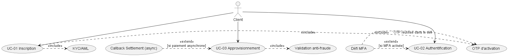
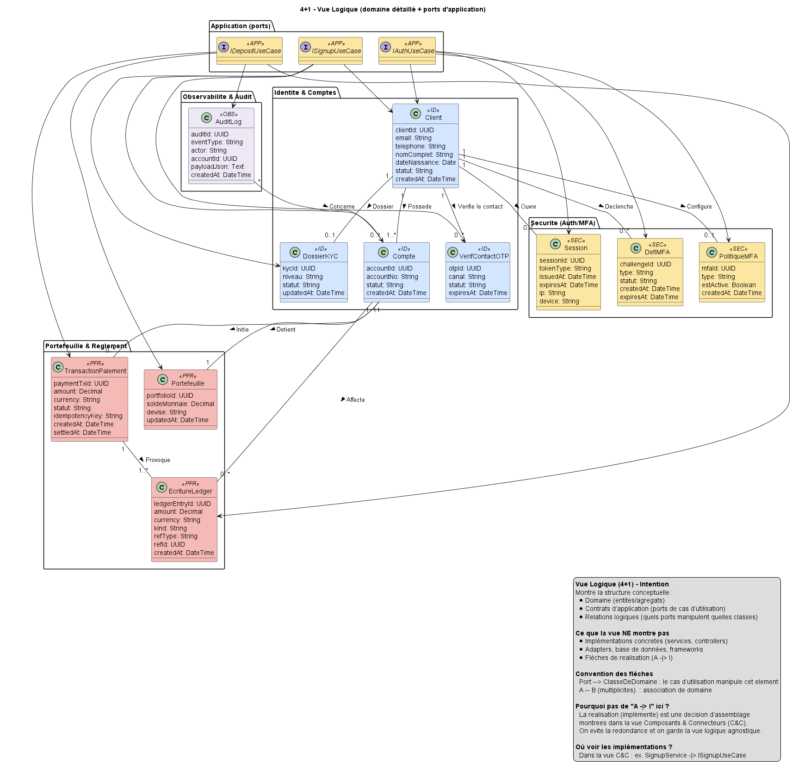
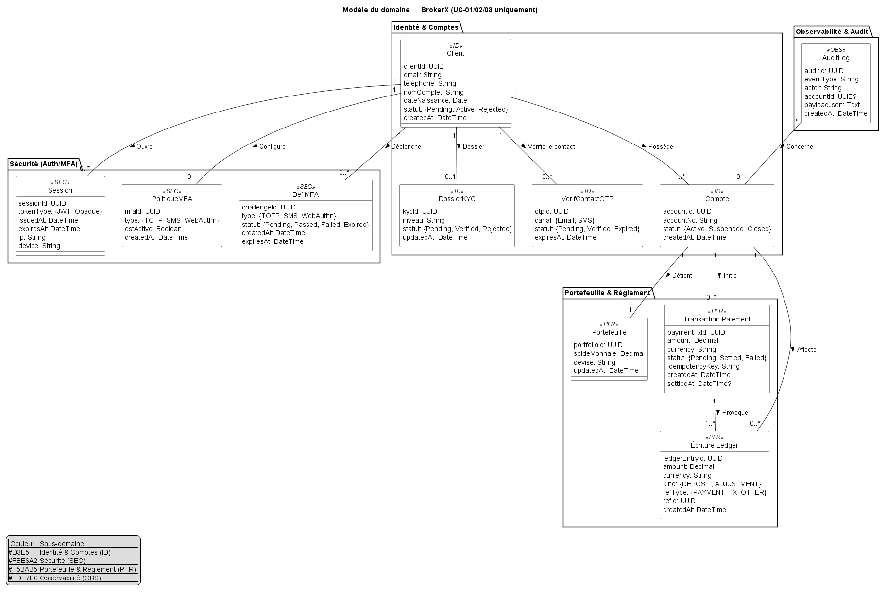
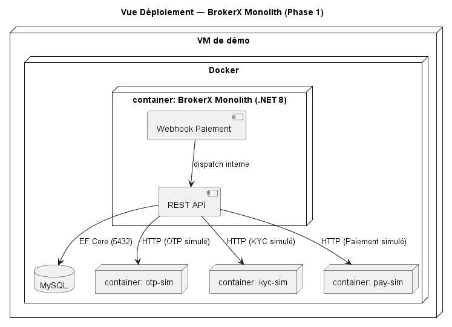

# BrokerX - Architecture Documentation (arc42)

**Version**: 1.0  
**Date**: 28 septembre 2025  
**Équipe**: Projet LOG-430  
**Status**: Phase 1 - Développement  

---

## Table des matières

1. [Exigences et contraintes](#1-exigences-et-contraintes)
2. [Contraintes d'architecture](#2-contraintes-darchitecture)
3. [Portée et contexte du système](#3-portée-et-contexte-du-système)
4. [Stratégie de solution](#4-stratégie-de-solution)
5. [Vue d'ensemble de la solution](#5-vue-densemble-de-la-solution)
6. [Vue d'implémentation](#6-vue-dimplémentation)
7. [Vue de déploiement](#7-vue-de-déploiement)
8. [Concepts transversaux](#8-concepts-transversaux)

---

## 1. Exigences et contraintes

### 1.1 Fonctionnalités clés

**BrokerX** est une plateforme de démonstration de trading sécurisé implémentant trois cas d'utilisation prioritaires :

- **UC-01 : Inscription** avec activation OTP et vérification KYC
- **UC-02 : Authentification** avec MFA (Multi-Factor Authentication) conditionnelle  
- **UC-03 : Dépôt de fonds** avec traitement asynchrone et idempotence

### 1.2 Exigences de qualité

| Qualité | Exigence | Justification |
|---------|----------|---------------|
| **Testabilité** | Domaine métier 100% testable sans infrastructure | Architecture hexagonale avec mocks |
| **Sécurité** | MFA obligatoire, chiffrement OTP, JWT | Conformité financière |
| **Idempotence** | Pas de double crédit/débit | Intégrité des transactions |
| **Évolutivité** | Intégration facile systèmes externes | Pattern Ports & Adapters |
| **Observabilité** | Audit trail complet | Conformité réglementaire |

### 1.3 Contraintes techniques

- **Plateforme** : .NET 9.0, C#
- **Base de données** : EF Core InMemoryDatabase (développement), MySQL/PostgreSQL (production)
- **Conteneurisation** : Docker + Docker Compose
- **Frontend** : HTML5 + Bootstrap 5 + Vanilla JavaScript
- **Architecture** : Hexagonale (Ports & Adapters)

---

## 2. Contraintes d'architecture

### 2.1 Contraintes organisationnelles

- **Équipe** : 1 développeurs, cycles par phases de 4 semaines
- **Environnement** : CI/CD avec tests automatisés
- **Documentation** : ADR (Architecture Decision Records) obligatoires

### 2.2 Contraintes techniques

| Contrainte | Description | Impact |
|------------|-------------|--------|
| **Clean Architecture** | Dépendances Domain ← Application ← Infrastructure | Tests unitaires faciles |
| **Pas de frameworks dans Domain** | Aucune dépendance EF/HTTP dans le cœur métier | Portabilité maximale |
| **Repository Pattern** | Abstraction de la persistance | Testabilité et flexibilité |
| **Immutabilité Ledger** | Table EcritureLedger en append-only | Audit trail inaltérable |

### 2.3 Contraintes de développement

- **Base de données** : InMemoryDatabase pour développement rapide
- **Pas de migrations** : EnsureCreated() pour simplicité
- **Configuration** : Variables d'environnement Docker
- **Logs** : Structured logging avec Serilog

---

## 3. Portée et contexte du système

### 3.1 Contexte métier

Le système BrokerX s'insère dans l'écosystème financier avec les acteurs externes suivants :


**Acteurs externes** :
- **Client** : Utilisateur final créant compte et effectuant dépôts
- **Système KYC** : Vérification d'identité (simulé)
- **Système de paiement** : Traitement des transactions (simulé)
- **Système Email/SMS** : Envoi OTP et notifications

### 3.2 Cas d'utilisation principaux



### 3.3 Interfaces externes

| Interface | Type | Description | Format |
|-----------|------|-------------|---------|
| **Web API** | REST | Endpoints clients | JSON/HTTP |
| **Email OTP** | SMTP | Codes d'activation | HTML Email |
| **Payment Gateway** | HTTP | Dépôts/retraits | JSON Webhook |
| **Audit Log** | File | Journalisation | Structured JSON |

---

## 4. Stratégie de solution

### 4.1 Décisions d'architecture clés

La solution repose sur **3 ADR (Architecture Decision Records)** principales :

#### ADR-001 : Architecture hexagonale
- **Décision** : Ports & Adapters avec séparation Domain/Application/Infrastructure
- **Justification** : Testabilité maximale, évolutivité vers microservices
- **Impact** : Inversion de dépendances, interfaces multiples

#### ADR-002 : Persistance EF Core InMemoryDatabase
- **Décision** : Repositories "InMemory*" utilisant EF Core sous le capot
- **Justification** : Développement rapide, tests isolés, transition facile vers production
- **Impact** : Pas de migrations, restart = perte données (acceptable en dev)

#### ADR-003 : Gestion d'erreurs HTTP standard
- **Décision** : Codes HTTP (400/401/404/422) avec messages JSON
- **Justification** : API prévisible, séparation domaine/présentation
- **Impact** : Contrôleurs minces, mapping exception→HTTP

### 4.2 Patterns architecturaux

| Pattern | Usage | Avantage |
|---------|-------|----------|
| **Hexagonal** | Structure globale | Testabilité, évolutivité |
| **Repository** | Accès données | Abstraction persistance |
| **Factory/Builder** | Création entités | Domaine encapsulé |
| **Adapter** | Intégrations externes | Découplage systèmes |

---

## 5. Vue d'ensemble de la solution

### 5.1 Vue logique (4+1)



**Domaines métier** :
- **Identité** : Client, ContactOtp, StatutClient
- **Sécurité** : PolitiqueMFA, DefiMFA, Session
- **Portefeuille** : Compte, Portefeuille, TransactionPaiement
- **Observabilité** : AuditLog, EcritureLedger

### 5.2 Vue des processus


**Flux asynchrones** :
1. **MFA Challenge** : Création défi → Email OTP → Validation
2. **Payment Settlement** : Pending → Processing → Settled
3. **Audit Logging** : Événement → Journal → Persistence

### 5.3 Modèle de données conceptuel



---

## 6. Vue d'implémentation

### 6.1 Structure des modules

```
src/
├── Domain/                     # Cœur métier pur
│   ├── Model/                 # Entités et agrégats
│   ├── Ports.Inbound/         # Contrats use cases
│   └── Ports.Outbound/        # Contrats infrastructure
├── Application/               # Orchestration métier
│   └── Services/              # Use cases concrets
├── Infrastructure.Persistence/ # EF Core + Repositories
├── Infrastructure.Adapters/   # Intégrations externes
└── Infrastructure.Web/        # API REST + Frontend
```

### 6.2 Vue de développement


**Principes de développement** :
- **Domain-first** : Modèles métier avant infrastructure
- **Outside-in testing** : Tests acceptation → tests unitaires
- **Contract-first** : Interfaces avant implémentations

### 6.3 Technologies par couche

| Couche | Technologies | Responsabilités |
|--------|-------------|-----------------|
| **Domain** | C# pur, aucune dépendance | Règles métier, entités |
| **Application** | C# + Domain | Use cases, orchestration |
| **Infrastructure** | EF Core, BCrypt, JWT | Persistance, intégrations |
| **Web** | ASP.NET Core, Bootstrap | API REST, interface utilisateur |

---

## 7. Vue de déploiement

### 7.1 Architecture de déploiement



### 7.2 Environnements

#### Développement local
```yaml
# docker-compose.yml
services:
  brokerx_app:
    build: .
    ports:
      - "5001:8080"
    environment:
      - ASPNETCORE_ENVIRONMENT=Development
    volumes:
      - ./logs:/app/logs
```

#### Production (future)
- **Kubernetes** : Déploiement scalable
- **MySQL/PostgreSQL** : Base de données persistante
- **Redis** : Cache et sessions
- **Monitoring** : Prometheus + Grafana

### 7.3 Sécurité déploiement

| Aspect | Développement | Production |
|--------|---------------|------------|
| **HTTPS** | Non requis | TLS 1.3 obligatoire |
| **Secrets** | Variables env | Azure Key Vault |
| **JWT** | Clé statique | Rotation automatique |
| **Base de données** | InMemory | Chiffrement au repos |

---

## 8. Concepts transversaux

### 8.1 Sécurité

#### Authentification et autorisation
- **JWT Tokens** : SessionId + expiration encodés en Base64
- **MFA obligatoire** : Email OTP avec BCrypt hashing
- **Session management** : Persistance EF Core, validation centralisée

#### Protection des données
```csharp
// Exemple : OTP sécurisé avec salt
var hashedOtp = BCrypt.Net.BCrypt.HashPassword(plainOtp, BCrypt.Net.BCrypt.GenerateSalt());
```

### 8.2 Gestion d'erreurs

#### Stratégie unifiée
```csharp
// Domain : Exceptions métier
throw new InvalidOperationException("MFA policy not found");

// Controller : Mapping HTTP
catch (InvalidOperationException ex) {
    return BadRequest(new { error = ex.Message });
}
```

### 8.3 Logging et observabilité

#### Audit trail
```csharp
await _audit.WriteAsync(
    AuditLog.Ecrire("AUTH_MFA_PASSED", "system", 
        payload: new { clientId, challengeId, sessionId }), ct);
```

#### Structured logging
- **ASP.NET Core** : Requêtes HTTP, erreurs
- **Domain Events** : Actions métier importantes
- **Performance** : Temps de réponse, métriques

### 8.4 Tests et qualité

#### Stratégie de test
```
tests/
├── Domain.Tests/              # Tests unitaires purs
├── Application.Tests/         # Tests d'intégration use cases
├── Infrastructure.Tests/      # Tests repositories/adapters
└── E2E.Tests/                 # Tests bout en bout API
```

#### Couverture cible
- **Domain** : 100% - logique métier critique
- **Application** : 95% - use cases principaux
- **Infrastructure** : 80% - adapters et repositories

### 8.5 Configuration et environnements

#### Variables d'environnement
```csharp
// appsettings.json
{
  "ConnectionStrings": {
    "DefaultConnection": "Server=localhost;Database=BrokerX"
  },
  "Jwt": {
    "SecretKey": "your-secret-key-min-256-bits",
    "ExpirationHours": 2
  },
  "Email": {
    "SmtpHost": "smtp.mailtrap.io",
    "SmtpPort": 587
  }
}
```

---

## Conclusion

L'architecture BrokerX respecte les principes **Clean Architecture** avec une séparation claire des responsabilités. L'utilisation d'**EF Core InMemoryDatabase** permet un développement rapide tout en conservant une structure prête pour la production. Les **ADR documentent les décisions** importantes et les **tests automatisés** garantissent la qualité du code.

### Points forts
- ✅ **Testabilité maximale** avec architecture hexagonale
- ✅ **Sécurité robuste** avec MFA et JWT
- ✅ **Développement rapide** avec InMemoryDatabase
- ✅ **Documentation vivante** avec ADR et diagrammes

### Évolutions futures
- 🔄 Migration vers base de données persistante (MySQL/PostgreSQL)
- 🔄 Implémentation microservices avec événements
- 🔄 Monitoring et observabilité avancés
- 🔄 API versioning et gestion breaking changes

---

*Document généré automatiquement le 28 septembre 2025*
