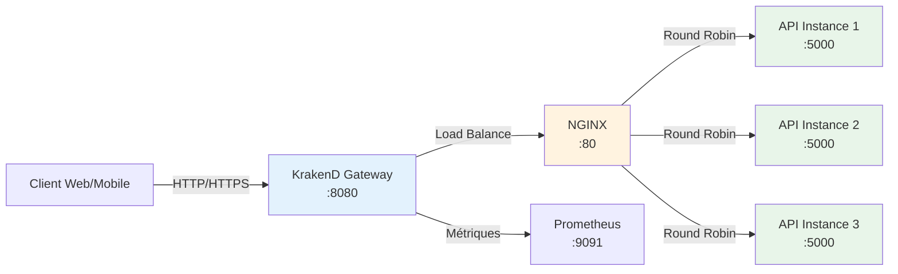
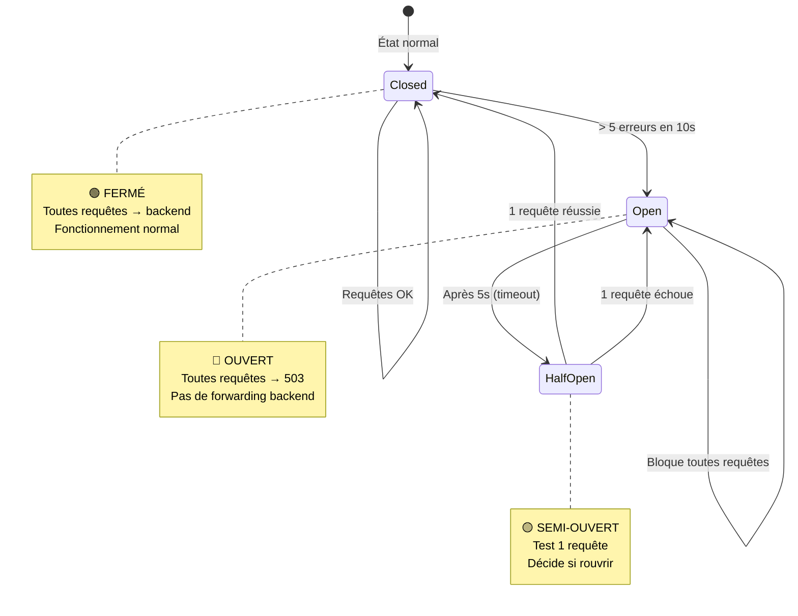

# 🚪 KrakenD API Gateway - Configuration Complète et Commentée

**Date:** 4 décembre 2025  
**Version:** 1.0  
**Objectif:** Comprendre chaque ligne de la configuration KrakenD de BrokerX

---

## 📋 Table des Matières

1. [Vue d'ensemble](#vue-densemble)
2. [Configuration Globale](#configuration-globale)
3. [Télémétrie et Observabilité](#télémétrie-et-observabilité)
4. [Endpoints et Routing](#endpoints-et-routing)
5. [Rate Limiting](#rate-limiting)
6. [Circuit Breaker](#circuit-breaker)
7. [Architecture Réseau](#architecture-réseau)
8. [Métriques Prometheus](#métriques-prometheus)

---

## 🎯 Vue d'ensemble

### Qu'est-ce que KrakenD ?

**KrakenD** est un **API Gateway** ultra-performant qui agit comme **point d'entrée unique** pour toutes les requêtes externes vers BrokerX.



### Rôle de KrakenD dans BrokerX

| **Fonctionnalité** | **Description** |
|--------------------|-----------------|
| **Rate Limiting** | Limite les requêtes par IP (protection DDoS) |
| **Circuit Breaker** | Coupe automatiquement si backend down |
| **Métriques** | Export vers Prometheus pour monitoring |
| **Routage** | Dirige les requêtes vers NGINX → API |
| **Cache** | Mise en cache des réponses (optionnel) |
| **Timeout** | Timeout global de 5 secondes |

---

## ⚙️ Configuration Globale

### Fichier : `krakend.json`

```json
{
  "$schema": "https://www.krakend.io/schema/v2.7/krakend.json",
  // ⭐ Validation du schéma JSON contre la spec KrakenD v2.7
  
  "version": 3,
  // ⭐ Version du format de configuration (v3 = dernière version stable)
  
  "name": "BrokerX API Gateway",
  // ⭐ Nom affiché dans les logs et métriques
  
  "port": 8080,
  // ⭐ Port d'écoute de KrakenD (externe)
  //    Clients appellent http://localhost:8080/api/v1/...
  
  "timeout": "5s",
  // ⭐ Timeout global pour TOUTES les requêtes backend
  //    Si backend ne répond pas en 5s → 504 Gateway Timeout
  
  "cache_ttl": "300s",
  // ⭐ TTL par défaut du cache (5 minutes)
  //    Peut être overridé par endpoint
  
  "output_encoding": "json"
  // ⭐ Format de sortie par défaut (json, xml, no-op)
}
```

#### Explications Détaillées

##### **$schema**
```json
"$schema": "https://www.krakend.io/schema/v2.7/krakend.json"
```
- **Validation IDE** : VS Code/IntelliJ valident la config en temps réel
- **Documentation** : Auto-complétion des propriétés
- **Sécurité** : Détection des erreurs avant déploiement

##### **version: 3**
```json
"version": 3
```
- **Format v3** : Support async, plugins, JWT, etc.
- **Rétrocompatibilité** : v2 encore supporté mais déprécié
- **Migration** : v3 apporte meilleures performances

##### **port: 8080**
```json
"port": 8080
```
**Pourquoi 8080 et pas 80 ?**
- ✅ **Port non-privilégié** : Pas besoin de `root` pour démarrer
- ✅ **Standard HTTP alternatif** : Convention pour gateways
- ✅ **Évite conflit** : NGINX écoute déjà sur :80

**Mapping des ports dans `docker-compose.yml` :**
```yaml
krakend:
  ports:
    - "8080:8080"  # Host:Container
  # Accessible depuis l'extérieur sur http://localhost:8080
```

##### **timeout: "5s"**
```json
"timeout": "5s"
```
**Impact du timeout :**
```
Client → KrakenD → NGINX → API
                    ↓
                  5 secondes max
                    ↓
           Si dépassé: 504 Gateway Timeout
```

**Cas d'usage :**
- ✅ **Requête normale** : Signup prend 200ms → OK
- ✅ **Requête lente** : Dépôt prend 2s → OK
- ❌ **Requête bloquée** : API freeze 6s → TIMEOUT

##### **cache_ttl: "300s"**
```json
"cache_ttl": "300s"
```
**Cache activé pour :**
- ❌ Pas utilisé actuellement (tous endpoints sont POST)
- ✅ Futur : GET balance, GET portfolio (5min cache)

**Exemple future :**
```json
{
  "endpoint": "/api/v1/accounts/{accountId}/balance",
  "method": "GET",
  "cache_ttl": "60s"  // Override: 1 minute pour balance
}
```

---

## 📊 Télémétrie et Observabilité

### Configuration Prometheus

```json
"extra_config": {
  "telemetry/opencensus": {
    // ⭐ OpenCensus = Standard de télémétrie (Google)
    
    "sample_rate": 100,
    // ⭐ Échantillonnage : 100 = capture 100% des requêtes
    //    En production : 10-20% pour réduire overhead
    
    "reporting_period": 1,
    // ⭐ Fréquence de reporting : toutes les 1 seconde
    //    Métriques agrégées et exposées chaque seconde
    
    "exporters": {
      "prometheus": {
        // ⭐ Exporter Prometheus (vs Zipkin, Jaeger, etc.)
        
        "port": 9091,
        // ⭐ Port Prometheus KrakenD (différent de 9090)
        //    http://localhost:9091/metrics
        
        "namespace": "krakend",
        // ⭐ Préfixe des métriques : krakend_http_requests_total
        
        "tag_host": false,
        // ⭐ Ne pas inclure hostname dans labels (évite cardinalité)
        
        "tag_path": true,
        // ⭐ Inclure path dans labels : {path="/api/v1/signup"}
        
        "tag_method": true,
        // ⭐ Inclure méthode HTTP : {method="POST"}
        
        "tag_statuscode": true
        // ⭐ Inclure code HTTP : {status_code="200"}
      }
    }
  }
}
```

#### Métriques Générées Automatiquement

##### **Requêtes Totales**
```prometheus
krakend_http_requests_total{
  method="POST",
  path="/api/v1/signup",
  status_code="200"
} 142
```

##### **Latence des Requêtes**
```prometheus
krakend_http_request_duration_seconds_bucket{
  method="POST",
  path="/api/v1/signup",
  le="0.5"  # Latence <= 500ms
} 120

krakend_http_request_duration_seconds_bucket{
  method="POST",
  path="/api/v1/signup",
  le="1.0"  # Latence <= 1s
} 142
```

##### **Requêtes en Cours**
```prometheus
krakend_http_requests_in_progress{
  method="POST",
  path="/api/v1/signup"
} 5  # 5 requêtes signup en cours d'exécution
```

#### Configuration Prometheus pour Scraping

**Fichier : `prometheus.yml`**
```yaml
scrape_configs:
  # KrakenD Métriques
  - job_name: 'krakend'
    scrape_interval: 15s
    static_configs:
      - targets: ['krakend:9091']  # ⭐ Port 9091, pas 9090
```

---

## 🛣️ Endpoints et Routing

### Structure d'un Endpoint

Chaque endpoint KrakenD définit :
1. **Route externe** (ce que le client appelle)
2. **Backend interne** (où KrakenD forwarde)
3. **Rate limiting** (protection)
4. **Circuit breaker** (résilience)

### Exemple Complet : Endpoint Signup

```json
{
  "endpoint": "/api/v1/signup",
  // ⭐ Route exposée aux clients
  //    Client appelle: http://krakend:8080/api/v1/signup
  
  "method": "POST",
  // ⭐ Méthode HTTP acceptée (POST uniquement)
  //    GET, PUT, DELETE → 405 Method Not Allowed
  
  "output_encoding": "json",
  // ⭐ Format de réponse (json, xml, string, no-op)
  
  "backend": [
    // ⭐ Liste des backends (1 seul ici, mais peut être multiple)
    {
      "url_pattern": "/api/v1/signup",
      // ⭐ URL backend (path seulement, host défini ci-dessous)
      //    KrakenD forwarde vers: http://nginx:80/api/v1/signup
      
      "encoding": "json",
      // ⭐ Format attendu du backend
      
      "method": "POST",
      // ⭐ Méthode HTTP vers backend (peut différer du endpoint)
      
      "host": ["http://nginx:80"],
      // ⭐ Adresse du backend (NGINX load balancer)
      //    Peut être une liste: ["http://nginx1:80", "http://nginx2:80"]
      //    KrakenD fait round-robin automatique
      
      "disable_host_sanitize": false
      // ⭐ Validation de l'URL backend (false = vérifier)
      //    Empêche injections d'URL malicieuses
    }
  ],
  
  "extra_config": {
    // ⭐ Configurations avancées (rate limiting, circuit breaker)
    // Voir sections suivantes
  }
}
```

### Tous les Endpoints Configurés

| **Endpoint** | **Méthode** | **Use Case** | **Rate Limit** |
|-------------|-------------|--------------|----------------|
| `/api/v1/signup` | POST | UC-01: Inscription | 10/client, 100/total |
| `/api/v1/signup/verify-otp` | POST | UC-01: Vérif OTP | 10/client, 100/total |
| `/api/v1/auth/login` | POST | UC-02: Login | 10/client, 100/total |
| `/api/v1/auth/mfa/verify` | POST | UC-02: Vérif MFA | 10/client, 100/total |
| `/api/v1/wallet/deposit` | POST | UC-03: Dépôt | **5/client**, 50/total |
| `/health` | GET | Health check | ∞ (pas de limit) |

---

## 🚦 Rate Limiting (Protection DDoS)

### Configuration Rate Limiting

```json
"extra_config": {
  "qos/ratelimit/router": {
    // ⭐ QoS = Quality of Service
    //    Router = Rate limiting au niveau gateway
    
    "max_rate": 100,
    // ⭐ Limite GLOBALE : 100 requêtes/seconde pour TOUS les clients
    //    Ex: 50 clients × 2 req/s chacun = 100 req/s total
    
    "client_max_rate": 10,
    // ⭐ Limite PAR CLIENT : 10 requêtes/seconde par IP
    //    Ex: 1 client ne peut pas faire plus de 10 req/s
    
    "strategy": "ip"
    // ⭐ Stratégie d'identification client
    //    "ip" = Basé sur adresse IP source
    //    "header" = Basé sur header custom (ex: X-Client-Id)
  }
}
```

#### Comportement Pratique

##### Scénario 1 : Client Normal
```
Client A (IP: 1.2.3.4) fait 5 req/s → ✅ OK (< 10)
Client B (IP: 5.6.7.8) fait 7 req/s → ✅ OK (< 10)
Total: 12 req/s → ✅ OK (< 100)
```

##### Scénario 2 : Client Malveillant
```
Attaquant (IP: 9.9.9.9) fait 50 req/s → ❌ BLOQUÉ à 10 req/s
Réponse HTTP: 429 Too Many Requests
Header: X-RateLimit-Remaining: 0
```

##### Scénario 3 : Trafic Massif
```
100 clients font 2 req/s chacun = 200 req/s
→ ❌ BLOQUÉ à 100 req/s (limite globale)
→ Requêtes 101-200 : 429 Too Many Requests
```

#### Rate Limits par Endpoint

```json
// Signup - Standard
"qos/ratelimit/router": {
  "max_rate": 100,        // 100 req/s global
  "client_max_rate": 10   // 10 req/s par IP
}

// Deposit - Plus Restrictif (opération financière)
"qos/ratelimit/router": {
  "max_rate": 50,         // 50 req/s global (division par 2)
  "client_max_rate": 5    // 5 req/s par IP (division par 2)
}
```

**Pourquoi plus restrictif pour Deposit ?**
- ✅ **Opération critique** : Transfert d'argent réel
- ✅ **Prévention abus** : Éviter spam de dépôts
- ✅ **Conformité** : Limiter tentatives de blanchiment

#### Configuration Avancée (Non Utilisée)

```json
// Exemple futur : Rate limit par header custom
"qos/ratelimit/router": {
  "max_rate": 1000,
  "client_max_rate": 100,
  "strategy": "header",
  "key": "X-API-Key"  // Rate limit basé sur clé API
}
```

---

## 🔌 Circuit Breaker (Résilience)

### Principe du Circuit Breaker

Le **Circuit Breaker** protège le backend en **coupant automatiquement** les requêtes si le backend est down ou lent.



### Configuration Circuit Breaker

```json
"extra_config": {
  "qos/circuit-breaker": {
    // ⭐ QoS = Quality of Service
    
    "interval": 10,
    // ⭐ Fenêtre de temps : 10 secondes
    //    Compte les erreurs sur les 10 dernières secondes
    
    "timeout": 5,
    // ⭐ Durée de l'état OUVERT : 5 secondes
    //    Après 5s, passe en SEMI-OUVERT pour tester
    
    "max_errors": 5,
    // ⭐ Seuil de déclenchement : 5 erreurs
    //    Si 5 erreurs en 10s → Circuit s'ouvre
    
    "log_status_change": true
    // ⭐ Logger les changements d'état
    //    Log: "Circuit breaker opened for /api/v1/signup"
  }
}
```

#### Scénarios d'Activation

##### Scénario 1 : Backend Crash
```
t=0s  : API crash (all requests fail)
t=0s  : Erreur 1/5 → Circuit FERMÉ
t=1s  : Erreur 2/5 → Circuit FERMÉ
t=2s  : Erreur 3/5 → Circuit FERMÉ
t=3s  : Erreur 4/5 → Circuit FERMÉ
t=4s  : Erreur 5/5 → ⚠️ Circuit OUVERT

t=4s-9s : Toutes requêtes → 503 Service Unavailable
          (Pas de forward backend, économise ressources)

t=9s  : Circuit passe en SEMI-OUVERT
t=9s  : Test 1 requête vers backend
        → Si OK: Circuit FERMÉ (reprend normal)
        → Si KO: Circuit OUVERT (5s de plus)
```

##### Scénario 2 : Backend Lent (Timeout)
```
t=0s  : Requête timeout après 5s (backend freeze)
t=5s  : Erreur 1/5 → Circuit FERMÉ
t=5s  : Nouvelle requête timeout
t=10s : Erreur 2/5 → Circuit FERMÉ
...
t=25s : Erreur 5/5 → ⚠️ Circuit OUVERT
```

##### Scénario 3 : Erreurs Sporadiques (Circuit Reste Fermé)
```
t=0s  : Requête OK
t=2s  : Erreur 1/5
t=4s  : Requête OK
t=6s  : Erreur 2/5
t=8s  : Requête OK
t=10s : Erreur 3/5
t=12s : Erreur 1/5 expire (window de 10s)
        → Compteur reset à 2 erreurs
        → Circuit reste FERMÉ
```

#### Métriques Circuit Breaker

```prometheus
# État du circuit (0=fermé, 1=ouvert, 2=semi-ouvert)
krakend_circuit_breaker_state{
  endpoint="/api/v1/signup"
} 0

# Nombre d'ouvertures
krakend_circuit_breaker_opened_total{
  endpoint="/api/v1/signup"
} 3
```

---

## 🌐 Architecture Réseau Docker

### Stack Complète

```
┌──────────────────────────────────────────────────────┐
│                    Internet / Client                 │
└───────────────────────┬──────────────────────────────┘
                        │
                        ↓
         ┌──────────────────────────────┐
         │  KrakenD API Gateway :8080   │ ← Point d'entrée unique
         │  - Rate Limiting             │
         │  - Circuit Breaker           │
         │  - Métriques Prometheus      │
         └──────────────┬───────────────┘
                        │
                        ↓
         ┌──────────────────────────────┐
         │  NGINX Load Balancer :80     │ ← Distribution de charge
         │  - Round Robin               │
         │  - Health Checks             │
         └──────────────┬───────────────┘
                        │
            ┌───────────┼───────────┐
            ↓           ↓           ↓
    ┌───────────┐ ┌───────────┐ ┌───────────┐
    │  API #1   │ │  API #2   │ │  API #3   │ ← Instances API
    │  :5000    │ │  :5000    │ │  :5000    │
    └─────┬─────┘ └─────┬─────┘ └─────┬─────┘
          │             │             │
          └─────────────┼─────────────┘
                        ↓
         ┌──────────────────────────────┐
         │  MySQL Database :3306        │ ← Persistance
         │  Redis Cache :6379           │
         └──────────────────────────────┘
```

### Configuration Docker Compose

#### Service KrakenD
```yaml
krakend:
  container_name: brokerx-krakend
  image: devopsfaith/krakend:2.7
  
  ports:
    - "8080:8080"   # ⭐ Gateway HTTP (externe)
    - "9091:9091"   # ⭐ Prometheus metrics (externe)
  
  volumes:
    - ./krakend.json:/etc/krakend/krakend.json:ro
    # ⭐ Mount configuration en lecture seule
    #    Changements nécessitent restart du conteneur
  
  depends_on:
    - nginx  # ⭐ Attend que NGINX soit ready
  
  networks:
    - brokerx-network  # ⭐ Réseau interne Docker
  
  restart: unless-stopped
  # ⭐ Redémarre automatiquement sauf si stoppé manuellement
```

#### Service NGINX (Backend de KrakenD)
```yaml
nginx:
  container_name: brokerx-nginx
  image: nginx:alpine
  
  ports:
    - "80:80"  # ⭐ Load balancer (externe)
  
  volumes:
    - ./nginx.conf:/etc/nginx/nginx.conf:ro
  
  depends_on:
    - api  # ⭐ Attend instances API
  
  networks:
    - brokerx-network
```

### Résolution DNS Docker

Dans le réseau `brokerx-network`, les services se résolvent par nom :

```json
// Dans krakend.json
"host": ["http://nginx:80"]
//               ↑
//        Nom du service Docker (pas localhost)
```

**Résolution DNS :**
```
nginx:80 → 172.20.0.5:80 (IP interne Docker)
api:5000 → 172.20.0.6:5000
```

---

## 📈 Métriques et Monitoring

### Endpoints Métriques Disponibles

| **Service** | **URL** | **Port** | **Métriques** |
|------------|---------|----------|---------------|
| **KrakenD** | http://localhost:9091/metrics | 9091 | Gateway (requests, latency, circuit breaker) |
| **API** | http://localhost:5000/metrics | 5000 | Application (cache, business logic) |
| **Prometheus** | http://localhost:9090 | 9090 | Dashboard Prometheus |
| **Grafana** | http://localhost:3000 | 3000 | Visualisation |

### Requêtes PromQL Utiles

#### 1. Taux de Requêtes par Endpoint
```promql
rate(krakend_http_requests_total[5m])
```

#### 2. Latence P95 Gateway
```promql
histogram_quantile(0.95, 
  rate(krakend_http_request_duration_seconds_bucket[5m])
)
```

#### 3. Taux d'Erreur 5xx
```promql
rate(krakend_http_requests_total{status_code=~"5.."}[5m])
```

#### 4. Circuit Breaker Ouvertures
```promql
increase(krakend_circuit_breaker_opened_total[1h])
```

#### 5. Rate Limit Dépassements
```promql
rate(krakend_ratelimit_exceeded_total[5m])
```

---

## 🛠️ Configuration Avancée (Non Utilisée)

### JWT Validation (Futur)

```json
// Valider JWT automatiquement
"extra_config": {
  "auth/validator": {
    "alg": "RS256",
    "jwk_url": "https://brokerx.com/.well-known/jwks.json",
    "disable_jwk_security": false,
    "cache": true,
    "cache_duration": 900
  }
}
```

### Agrégation de Backends (Futur)

```json
// Combiner plusieurs backends en 1 réponse
{
  "endpoint": "/api/v1/dashboard",
  "backend": [
    {
      "url_pattern": "/api/v1/accounts/{accountId}/balance",
      "host": ["http://nginx:80"]
    },
    {
      "url_pattern": "/api/v1/accounts/{accountId}/positions",
      "host": ["http://nginx:80"]
    }
  ]
  // KrakenD fait 2 requêtes en parallèle et merge les résultats
}
```

### Response Manipulation (Futur)

```json
// Modifier la réponse avant de la renvoyer
"extra_config": {
  "modifier/martian": {
    "body.Modifier": {
      "scope": ["response"],
      "type": "json",
      "actions": [
        {
          "key": "password",
          "value": "***REDACTED***",
          "scope": ["response"]
        }
      ]
    }
  }
}
```

---

## 🧪 Tests et Validation

### Tester Rate Limiting

```bash
# Envoyer 15 requêtes rapidement (dépasse limit de 10/s)
for i in {1..15}; do
  curl -X POST http://localhost:8080/api/v1/signup \
    -H "Content-Type: application/json" \
    -d '{"email":"test@test.com","password":"test123"}' &
done

# Résultat attendu:
# - Requêtes 1-10: 200 OK
# - Requêtes 11-15: 429 Too Many Requests
```

### Tester Circuit Breaker

```bash
# 1. Arrêter le backend
docker stop brokerx-api

# 2. Envoyer 5 requêtes pour déclencher circuit breaker
for i in {1..5}; do
  curl -X POST http://localhost:8080/api/v1/signup \
    -H "Content-Type: application/json" \
    -d '{"email":"test@test.com","password":"test123"}'
  sleep 1
done

# 3. Circuit breaker s'ouvre après 5 erreurs
curl -X POST http://localhost:8080/api/v1/signup \
  -H "Content-Type: application/json" \
  -d '{"email":"test@test.com","password":"test123"}'
# → 503 Service Unavailable (circuit breaker ouvert)

# 4. Redémarrer backend
docker start brokerx-api

# 5. Attendre 5s (timeout circuit breaker)
sleep 5

# 6. Tester à nouveau → Circuit se ferme
curl -X POST http://localhost:8080/api/v1/signup \
  -H "Content-Type: application/json" \
  -d '{"email":"test@test.com","password":"test123"}'
# → 200 OK (circuit refermé)
```

### Vérifier Métriques

```bash
# Voir métriques KrakenD
curl http://localhost:9091/metrics

# Filtrer requêtes signup
curl http://localhost:9091/metrics | grep signup

# Output attendu:
# krakend_http_requests_total{method="POST",path="/api/v1/signup",status_code="200"} 42
# krakend_http_request_duration_seconds_count{method="POST",path="/api/v1/signup"} 42
```

---

## 🔧 Commandes Utiles

### Démarrage/Arrêt

```bash
# Démarrer KrakenD seul
docker compose up -d krakend

# Voir logs en temps réel
docker logs -f brokerx-krakend

# Redémarrer après changement config
docker compose restart krakend

# Valider configuration
docker run --rm -v $PWD/krakend.json:/etc/krakend/krakend.json \
  devopsfaith/krakend:2.7 check -c /etc/krakend/krakend.json
```

### Debug

```bash
# Tester connectivité KrakenD → NGINX
docker exec brokerx-krakend wget -O- http://nginx:80/health

# Tester connectivité NGINX → API
docker exec brokerx-nginx wget -O- http://api:5000/health

# Voir configuration active
docker exec brokerx-krakend cat /etc/krakend/krakend.json
```

---

## 📚 Résumé - Points Clés

### Configuration Actuelle

✅ **6 endpoints configurés** : Signup, OTP, Login, MFA, Deposit, Health  
✅ **Rate limiting actif** : 10 req/s/IP pour auth, 5 req/s/IP pour deposit  
✅ **Circuit breaker actif** : 5 erreurs → ouverture circuit  
✅ **Métriques Prometheus** : Port 9091, 100% sampling  
✅ **Load balancing** : Via NGINX (round-robin)  

### Architecture en 3 Couches

```
1. KrakenD (Gateway)  → Protection + Rate Limiting
2. NGINX (Load Balancer) → Distribution de charge
3. API Instances (Backend) → Logique métier
```

### Bénéfices pour BrokerX

🔒 **Sécurité** : Protection DDoS avec rate limiting  
⚡ **Performance** : Cache + timeout courts  
🛡️ **Résilience** : Circuit breaker protège backends  
📊 **Observabilité** : Métriques détaillées pour monitoring  
📈 **Scalabilité** : Supporte montée en charge horizontale  

---

**Fin du Guide KrakenD Configuration**
