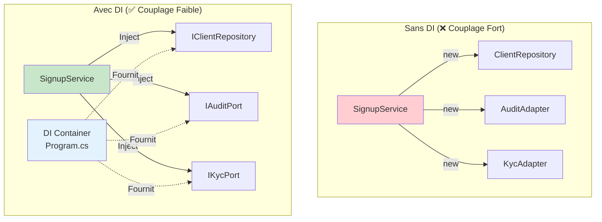
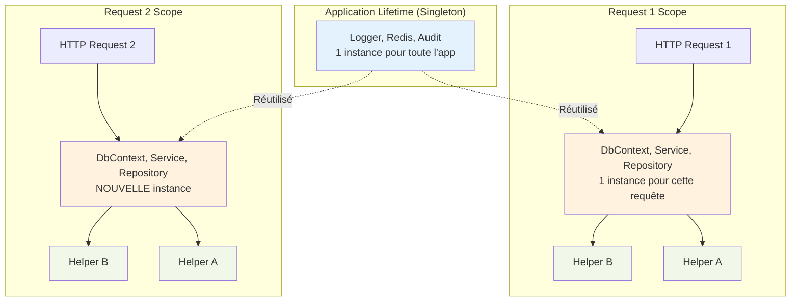

# 💉 Injection de Dépendances dans Program.cs - Guide Complet

**Date:** 4 décembre 2025  
**Version:** 1.0  
**Objectif:** Comprendre l'injection de dépendances, les lifetimes (Singleton, Scoped, Transient), et la configuration complète de Program.cs

---

## 📋 Table des Matières

1. [Vue d'ensemble de l'Injection de Dépendances](#vue-densemble)
2. [Lifetimes : Singleton, Scoped, Transient](#lifetimes)
3. [Configuration Serilog](#serilog)
4. [Configuration Entity Framework Core](#entity-framework)
5. [Configuration Redis Cache](#redis-cache)
6. [Configuration SignalR](#signalr)
7. [Enregistrement des Services](#enregistrement-services)
8. [Configuration CORS](#cors)
9. [Middleware Pipeline](#middleware-pipeline)
10. [Initialisation au Démarrage](#initialisation)

---

## 🎯 Vue d'ensemble de l'Injection de Dépendances

### Qu'est-ce que l'Injection de Dépendances (DI) ?

L'**Injection de Dépendances** est un pattern qui permet de :
- ✅ **Découpler** les classes de leurs dépendances
- ✅ **Faciliter les tests** avec des mocks
- ✅ **Gérer le cycle de vie** des objets automatiquement
- ✅ **Respecter SOLID** (Dependency Inversion Principle)



### Architecture du Program.cs

```
Program.cs
├── 1. Configuration Serilog (avant builder)
├── 2. Configuration Services (builder.Services.Add...)
│   ├── CORS
│   ├── Entity Framework Core
│   ├── Redis Cache
│   ├── SignalR
│   ├── Use Cases (Scoped)
│   ├── Repositories (Scoped)
│   └── Adapters (Singleton/Scoped)
├── 3. Configuration Middleware (app.Use...)
│   ├── CORS
│   ├── URL Rewriting
│   ├── Static Files
│   ├── Prometheus Metrics
│   └── Routing
└── 4. Initialisation (using scope)
    ├── EF Core Database.EnsureCreated()
    └── Redis Connection Test
```

---

## ⏱️ Lifetimes : Singleton, Scoped, Transient

### Différences Fondamentales

| **Lifetime** | **Durée de Vie** | **Partage** | **Use Cases** |
|-------------|------------------|-------------|---------------|
| **Singleton** | Toute la vie de l'app | Partagé entre TOUTES les requêtes | Config, Cache, Logs, Connexions lourdes |
| **Scoped** | Durée d'une requête HTTP | Partagé dans UNE requête | Repositories, Services métier, DbContext |
| **Transient** | À chaque injection | Nouvelle instance TOUJOURS | Services légers, sans état |

### Visualisation des Lifetimes



### Exemples de Code

#### Singleton - 1 Instance Globale
```csharp
// ⭐ SINGLETON : Créé une seule fois au démarrage
builder.Services.AddSingleton<IAuditPort>(
    new StructuredAuditAdapter("logs/audit.jsonl")
);

// Utilisation dans 2 requêtes différentes :
// Request 1 → SignupService.ctor(IAuditPort audit) → Instance #1
// Request 2 → AuthService.ctor(IAuditPort audit)   → Instance #1 (MÊME)
```

**Pourquoi Singleton pour Audit ?**
- ✅ **Performance** : Pas de création/destruction à chaque requête
- ✅ **Thread-safe** : `StructuredAuditAdapter` gère la concurrence
- ✅ **Fichier partagé** : Tous écrivent dans `logs/audit.jsonl`

#### Scoped - 1 Instance par Requête
```csharp
// ⭐ SCOPED : Nouvelle instance par requête HTTP
builder.Services.AddScoped<ISignupUseCase, SignupService>();
builder.Services.AddScoped<IClientRepository, InMemoryClientRepository>();

// Utilisation dans une requête :
// HTTP POST /signup → SignupService créé
//                  → ClientRepository créé
//                  → SignupService utilise ClientRepository
//                  → Fin requête : DISPOSE des 2
//
// HTTP POST /signup (2ème requête) → NOUVELLES instances
```

**Pourquoi Scoped pour Services ?**
- ✅ **Isolation** : Chaque requête a son contexte propre
- ✅ **DbContext** : EF Core nécessite Scoped (une transaction par requête)
- ✅ **Thread-safe** : Pas de concurrence entre requêtes

#### Transient - Nouvelle Instance à Chaque Injection
```csharp
// ⭐ TRANSIENT : Nouvelle instance à chaque GetService
builder.Services.AddTransient<IEmailSender, EmailSender>();

// Utilisation :
// SignupService.ctor(IEmailSender sender1) → Instance A créée
// OtpService.ctor(IEmailSender sender2)    → Instance B créée (DIFFÉRENTE)
// Même si injectés dans la même requête !
```

**Pourquoi Transient (rare) ?**
- ✅ **Léger** : Pas d'état partagé
- ✅ **Sécurité** : Évite contamination entre usages
- ⚠️ **Coûteux** : Création fréquente, éviter pour services lourds

### Règles de Choix du Lifetime

```
┌─────────────────────────────────────────────────────┐
│ Flowchart : Quel Lifetime Choisir ?                │
└─────────────────────────────────────────────────────┘

1. Est-ce que l'objet est TRÈS COÛTEUX à créer ?
   (Connexion DB, fichiers, HTTP clients)
   │
   ├─ OUI → SINGLETON (si thread-safe)
   │
   └─ NON → 2. Est-ce que l'objet a un ÉTAT qui change ?
             │
             ├─ OUI → 3. L'état doit-il être partagé ?
             │        │
             │        ├─ Entre requêtes → SINGLETON
             │        └─ Dans une requête → SCOPED
             │
             └─ NON → 4. Est-ce que l'objet dépend de DbContext ?
                       │
                       ├─ OUI → SCOPED (obligatoire)
                       └─ NON → TRANSIENT (par défaut)
```

### ⚠️ Pièges Courants

#### Piège 1 : Scoped dans Singleton
```csharp
// ❌ ERREUR : Ne JAMAIS injecter Scoped dans Singleton
builder.Services.AddSingleton<MyService>();  // Singleton
builder.Services.AddScoped<BrokerXDbContext>(); // Scoped

public class MyService
{
    private readonly BrokerXDbContext _db; // ❌ ERREUR !
    
    // Le Singleton garde le DbContext pour toute la vie de l'app
    // → DbContext devient partagé entre requêtes
    // → DANGER : Concurrence, état corrompu
}
```

**Solution :**
```csharp
// ✅ BON : Injecter IServiceProvider et créer des scopes manuellement
public class MyService
{
    private readonly IServiceProvider _serviceProvider;
    
    public async Task DoWork()
    {
        using var scope = _serviceProvider.CreateScope();
        var db = scope.ServiceProvider.GetRequiredService<BrokerXDbContext>();
        // Utiliser db dans ce scope uniquement
    }
}
```

#### Piège 2 : DbContext en Singleton
```csharp
// ❌ NE JAMAIS FAIRE ÇA
builder.Services.AddSingleton<BrokerXDbContext>();

// Pourquoi c'est dangereux ?
// - DbContext n'est PAS thread-safe
// - Concurrent requests → corruption de données
// - Change tracking devient global → mémoire leak
```

---

## 📝 Configuration Serilog (Logs Structurés)

### Vue d'ensemble

**Serilog** est configuré **AVANT** la création du builder, pour capturer les logs de démarrage.

### Code Complet Commenté

```csharp
using Serilog;
using Serilog.Formatting.Compact;

// ⭐ Configuration AVANT builder.Build()
Log.Logger = new LoggerConfiguration()
    
    // ===== ENRICHISSEURS (Ajout de contexte automatique) =====
    .Enrich.FromLogContext()
    // ⭐ Permet d'ajouter des propriétés dynamiques dans les logs
    //    Exemple : using (LogContext.PushProperty("UserId", userId))
    
    .Enrich.WithThreadId()
    // ⭐ Ajoute l'ID du thread qui a émis le log
    //    Utile pour débugger concurrence
    
    .Enrich.WithMachineName()
    // ⭐ Ajoute le nom de la machine (hostname)
    //    Utile en cluster (savoir quelle instance a logué)
    
    .Enrich.WithProperty("Application", "BrokerX")
    // ⭐ Propriété fixe ajoutée à TOUS les logs
    
    .Enrich.WithProperty("Environment", 
        Environment.GetEnvironmentVariable("ASPNETCORE_ENVIRONMENT") ?? "Production")
    // ⭐ Environnement (Development, Staging, Production)
    
    // ===== NIVEAUX DE LOG (Filtrage) =====
    .MinimumLevel.Information()
    // ⭐ Niveau global : Information et au-dessus (Warning, Error, Fatal)
    //    Niveaux ignorés : Verbose, Debug
    
    .MinimumLevel.Override("Microsoft", Serilog.Events.LogEventLevel.Warning)
    // ⭐ Réduire verbosité de Microsoft.* (AspNetCore, EntityFramework)
    //    Ignore Info/Debug de ces namespaces
    
    .MinimumLevel.Override("System", Serilog.Events.LogEventLevel.Warning)
    // ⭐ Réduire verbosité de System.* (framework .NET)
    
    .MinimumLevel.Override("Application", Serilog.Events.LogEventLevel.Information)
    // ⭐ Forcer Information pour namespace Application.*
    
    .MinimumLevel.Override("Domain", Serilog.Events.LogEventLevel.Information)
    // ⭐ Forcer Information pour namespace Domain.*
    
    // ===== SINKS (Destinations des logs) =====
    .WriteTo.Console(new CompactJsonFormatter())
    // ⭐ Écrire dans la console (stdout) en JSON compact
    //    Docker Compose capte ces logs automatiquement
    //    Format : {"@t":"2025-12-04T10:30:00Z","@m":"User logged in","UserId":123}
    
    .WriteTo.File(
        new CompactJsonFormatter(),
        "logs/app-.jsonl",                    // ⭐ Pattern de fichier
        rollingInterval: RollingInterval.Day, // ⭐ Rotation quotidienne
        retainedFileCountLimit: 7)            // ⭐ Garder 7 jours
    // ⭐ Écrire dans des fichiers journaliers
    //    Fichiers créés : app-20251204.jsonl, app-20251205.jsonl, ...
    //    Après 7 jours : suppression automatique
    
    .CreateLogger();
    // ⭐ Construire le logger statique global

try
{
    Log.Information("🚀 BrokerX API démarrage...");
    // ⭐ Premier log avant même le builder
    
    var builder = WebApplication.CreateBuilder(args);
    
    // ===== INTÉGRATION AVEC ASP.NET CORE =====
    builder.Host.UseSerilog();
    // ⭐ Remplace le logger par défaut de .NET par Serilog
    //    Tous les logs Microsoft.* utilisent maintenant Serilog
    
    // ... reste de la configuration
}
catch (Exception ex)
{
    Log.Fatal(ex, "❌ L'application BrokerX a échoué au démarrage");
    throw;
}
finally
{
    Log.Information("🛑 BrokerX API arrêt");
    Log.CloseAndFlush();
    // ⭐ IMPORTANT : Flush les buffers avant de quitter
    //    Sans ça, les derniers logs peuvent être perdus
}
```

### Niveaux de Log Serilog

| **Niveau** | **Usage** | **Exemple** |
|-----------|-----------|-------------|
| **Verbose** | Trace détaillée (désactivé) | `Log.Verbose("Query: {Sql}", sql)` |
| **Debug** | Informations de debug (désactivé) | `Log.Debug("Cache miss for {Key}", key)` |
| **Information** | Événements normaux | `Log.Information("User {UserId} logged in", userId)` |
| **Warning** | Situations anormales mais gérables | `Log.Warning("Rate limit exceeded for {IP}", ip)` |
| **Error** | Erreurs nécessitant attention | `Log.Error(ex, "Failed to save {Entity}", entity)` |
| **Fatal** | Crash de l'application | `Log.Fatal(ex, "Database connection failed")` |

### Exemple de Log Structuré

```csharp
// Code dans SignupService.cs
Log.Information("Client inscrit: {ClientId}, Email: {Email}, KYC: {KycStatus}", 
    client.ClientId, client.Email, kycResult.Status);

// Output dans logs/app-20251204.jsonl :
{
  "@t": "2025-12-04T10:30:45.1234567Z",
  "@m": "Client inscrit: abc-123, Email: alice@test.com, KYC: Pending",
  "@l": "Information",
  "ClientId": "abc-123",
  "Email": "alice@test.com",
  "KycStatus": "Pending",
  "Application": "BrokerX",
  "Environment": "Production",
  "MachineName": "brokerx-api-1",
  "ThreadId": 42
}
```

### Format Compact JSON

**Pourquoi JSON Compact ?**
- ✅ **Parsing facile** : Tools comme Grafana Loki, ELK peuvent l'ingérer
- ✅ **1 ligne = 1 log** : Facile à grep/tail
- ✅ **Structured** : Requêtes sur propriétés (ex: WHERE ClientId = '...')

**Alternative : JSON indenté (développement)**
```csharp
.WriteTo.Console(new Serilog.Formatting.Json.JsonFormatter(renderMessage: true))
// Output plus lisible mais verbeux :
{
  "@timestamp": "2025-12-04T10:30:45.1234567Z",
  "@message": "Client inscrit",
  "ClientId": "abc-123",
  ...
}
```

### Rotation et Rétention

```csharp
.WriteTo.File(
    "logs/app-.jsonl",
    rollingInterval: RollingInterval.Day,      // ⭐ Nouveau fichier chaque jour
    retainedFileCountLimit: 7)                 // ⭐ Supprime après 7 jours
```

**Fichiers créés :**
```
logs/
├── app-20251127.jsonl  ← Supprimé (> 7 jours)
├── app-20251128.jsonl  ← Supprimé (> 7 jours)
├── app-20251129.jsonl  (Conservé : 7 jours)
├── app-20251130.jsonl  (Conservé : 6 jours)
├── app-20251201.jsonl  (Conservé : 5 jours)
├── app-20251202.jsonl  (Conservé : 4 jours)
├── app-20251203.jsonl  (Conservé : 3 jours)
└── app-20251204.jsonl  (Aujourd'hui)
```

**Alternatives :**
```csharp
// Rotation par heure (pour apps très verbeuses)
rollingInterval: RollingInterval.Hour

// Rotation par taille (50 MB max par fichier)
fileSizeLimitBytes: 50_000_000

// Garder 30 jours (compliance)
retainedFileCountLimit: 30
```

---

## 🗄️ Configuration Entity Framework Core

### Vue d'ensemble

Entity Framework Core est l'**ORM** (Object-Relational Mapper) utilisé pour accéder à la base de données.

### Code Complet Commenté

```csharp
using Microsoft.EntityFrameworkCore;
using ProjetLog430.Infrastructure.Persistence;

// ===== CHAÎNE DE CONNEXION =====
var cs = builder.Configuration.GetConnectionString("BrokerX")
         ?? "Server=mysql;Port=3306;Database=brokerx;User Id=brokerx;Password=brokerx;TreatTinyAsBoolean=false";
// ⭐ Priorité :
//    1. appsettings.json → "ConnectionStrings:BrokerX"
//    2. Fallback hardcodé (pour Docker Compose)

// ===== ENREGISTREMENT DU DbContext =====
builder.Services.AddDbContext<BrokerXDbContext>(opt =>
    opt.UseInMemoryDatabase("TestDatabase"));
// ⭐ ATTENTION : Configuration actuelle utilise InMemory (pour tests)
//    En production, utiliser :
//    opt.UseMySql(cs, ServerVersion.AutoDetect(cs))

// ⭐ LIFETIME : Scoped automatiquement
//    AddDbContext<T>() enregistre T comme Scoped
//    Une nouvelle instance BrokerXDbContext par requête HTTP
```

### Pourquoi InMemoryDatabase (Actuel) ?

```csharp
opt.UseInMemoryDatabase("TestDatabase")
```

**Avantages :**
- ✅ **Pas de setup** : Pas besoin de MySQL installé
- ✅ **Rapide** : Tests unitaires ultra-rapides
- ✅ **Isolation** : Chaque test a sa propre DB

**Inconvénients :**
- ❌ **Données perdues** : Redémarrage → reset complet
- ❌ **Pas de concurrence** : Pas de vraie transactionalité
- ❌ **Pas de migrations** : Pas de schema evolution

### Configuration Production (MySQL avec Pomelo)

```csharp
// ⭐ PRODUCTION : Utiliser MySQL réel
builder.Services.AddDbContext<BrokerXDbContext>(opt =>
{
    opt.UseMySql(cs, ServerVersion.AutoDetect(cs),
        mysqlOptions =>
        {
            // ⭐ Retry automatique en cas d'erreur transitoire
            mysqlOptions.EnableRetryOnFailure(
                maxRetryCount: 5,
                maxRetryDelay: TimeSpan.FromSeconds(10),
                errorNumbersToAdd: null);
            
            // ⭐ Timeout de commande (30 secondes)
            mysqlOptions.CommandTimeout(30);
            
            // ⭐ Migrations assembly
            mysqlOptions.MigrationsAssembly("Infrastructure.Persistence");
        });
    
    // ⭐ Logging EF Core (WARNING seulement en prod)
    opt.LogTo(Console.WriteLine, LogLevel.Warning);
    
    // ⭐ Détection de changements sensible
    opt.EnableSensitiveDataLogging(false); // Désactivé en prod (sécurité)
    opt.EnableDetailedErrors(false);       // Désactivé en prod (perf)
});
```

### Chaîne de Connexion Expliquée

```csharp
"Server=mysql;Port=3306;Database=brokerx;User Id=brokerx;Password=brokerx;TreatTinyAsBoolean=false"
```

| **Paramètre** | **Valeur** | **Explication** |
|--------------|-----------|-----------------|
| `Server` | `mysql` | Hostname Docker (service MySQL dans docker-compose.yml) |
| `Port` | `3306` | Port MySQL standard |
| `Database` | `brokerx` | Nom de la base de données |
| `User Id` | `brokerx` | Utilisateur MySQL |
| `Password` | `brokerx` | Mot de passe (⚠️ À changer en prod !) |
| `TreatTinyAsBoolean` | `false` | TINYINT(1) → pas converti en bool (garder int8) |

### Configuration appsettings.json

```json
{
  "ConnectionStrings": {
    "BrokerX": "Server=mysql;Port=3306;Database=brokerx;User Id=brokerx;Password=brokerx;TreatTinyAsBoolean=false"
  },
  "Logging": {
    "LogLevel": {
      "Microsoft.EntityFrameworkCore": "Warning"
    }
  }
}
```

### Initialisation au Démarrage

```csharp
// ⭐ SECTION : Créer/vérifier la base de données au démarrage
using (var scope = app.Services.CreateScope())
{
    var dbContext = scope.ServiceProvider.GetRequiredService<BrokerXDbContext>();
    
    try 
    {
        // ⭐ Créer la base de données si elle n'existe pas
        dbContext.Database.EnsureCreated();
        // En production, utiliser plutôt :
        // await dbContext.Database.MigrateAsync(); // Applique migrations
        
        var logger = scope.ServiceProvider.GetRequiredService<ILogger<Program>>();
        logger.LogInformation("✅ Base de données vérifiée/créée avec succès");
        
        // ⭐ Optionnel : Lister les tables pour debug
        var tableNames = dbContext.Model.GetEntityTypes()
            .Select(t => t.GetTableName())
            .Where(name => !string.IsNullOrEmpty(name))
            .ToList();
            
        logger.LogInformation("📋 Tables configurées dans EF: {Tables}", 
            string.Join(", ", tableNames));
    }
    catch (Exception ex)
    {
        var logger = scope.ServiceProvider.GetRequiredService<ILogger<Program>>();
        logger.LogError(ex, "❌ Erreur lors de la création/vérification de la base de données");
        throw; // Arrêter l'application si la DB ne peut pas être créée
    }
}
```

**Différence EnsureCreated vs Migrate :**

| **Méthode** | **Usage** | **Migrations** |
|------------|-----------|----------------|
| `EnsureCreated()` | Développement/Tests | ❌ Ignore migrations |
| `Migrate()` | **Production** | ✅ Applique migrations |

---

## 🔴 Configuration Redis Cache

### Vue d'ensemble

Redis est utilisé comme **cache distribué** pour améliorer les performances et permettre le partage d'état entre instances API.

### Code Complet Commenté

```csharp
using StackExchange.Redis;
using ProjetLog430.Infrastructure.Adapters.Cache;

// ===== CHAÎNE DE CONNEXION REDIS =====
var redisConnectionString = builder.Configuration["Redis:ConnectionString"] 
    ?? "localhost:6379,abortConnect=false";
// ⭐ Priorité :
//    1. appsettings.json → "Redis:ConnectionString"
//    2. Fallback : localhost (Docker Compose utilise "redis:6379")

Log.Information("🔧 Configuration Redis: {RedisConnectionString}", redisConnectionString);

// ===== ENREGISTREMENT ConnectionMultiplexer (SINGLETON) =====
builder.Services.AddSingleton<IConnectionMultiplexer>(sp =>
{
    // ⭐ Configuration StackExchange.Redis
    var configuration = ConfigurationOptions.Parse(redisConnectionString);
    
    // ⭐ IMPORTANT : Graceful degradation
    configuration.AbortOnConnectFail = false;
    // Si Redis down au démarrage → app démarre quand même
    // Reconnecte automatiquement quand Redis revient
    
    Log.Information("🔌 Tentative connexion Redis...");
    
    // ⭐ Connexion (opération coûteuse)
    var conn = ConnectionMultiplexer.Connect(configuration);
    
    Log.Information("✅ Redis connecté: {Endpoints}, Status: {IsConnected}", 
        string.Join(", ", conn.GetEndPoints().Select(e => e.ToString())), 
        conn.IsConnected);
    
    return conn;
    // ⭐ SINGLETON : Cette instance est PARTAGÉE par toute l'app
    //    ConnectionMultiplexer gère un pool de connexions interne
    //    Thread-safe et optimisé pour concurrence
});

// ===== ENREGISTREMENT RedisCacheAdapter (SINGLETON) =====
builder.Services.AddSingleton<ICachePort, RedisCacheAdapter>();
// ⭐ SINGLETON : Adaptateur stateless qui utilise ConnectionMultiplexer
//    Peut être partagé entre toutes les requêtes
```

### Pourquoi Singleton pour Redis ?

**ConnectionMultiplexer** est conçu pour être **partagé** :
- ✅ **Thread-safe** : Gère concurrence automatiquement
- ✅ **Pool de connexions** : Réutilise connexions TCP
- ✅ **Reconnexion auto** : Si Redis redémarre, reconnecte automatiquement
- ✅ **Performance** : Évite overhead de créer/détruire connexions

**Coût de Création :**
```csharp
// ❌ NE JAMAIS FAIRE : Scoped ou Transient pour ConnectionMultiplexer
builder.Services.AddScoped<IConnectionMultiplexer>(...); // ERREUR !

// Problème :
// - Création de connexion TCP : 50-200ms
// - 100 requêtes/s = 100 × 200ms = 20 secondes de connexion !
// - Épuisement des ports TCP
// - Redis rejette les connexions
```

### Configuration Avancée

```csharp
var configuration = ConfigurationOptions.Parse(redisConnectionString);

// ===== OPTIONS IMPORTANTES =====
configuration.AbortOnConnectFail = false;
// ⭐ false : Ne pas crash si Redis down (graceful degradation)
// ⭐ true  : Throw exception si connexion échoue (fail-fast)

configuration.ConnectTimeout = 5000; // 5 secondes
// ⭐ Timeout pour établir la connexion initiale

configuration.SyncTimeout = 5000; // 5 secondes
// ⭐ Timeout pour opérations synchrones

configuration.AsyncTimeout = 5000; // 5 secondes
// ⭐ Timeout pour opérations asynchrones

configuration.ConnectRetry = 3;
// ⭐ Nombre de tentatives de reconnexion

configuration.KeepAlive = 60; // Secondes
// ⭐ Keep-alive TCP pour détecter connexions mortes

// ===== LOGGING REDIS =====
var logWriter = new StringWriter();
configuration.LoggerFactory = LoggerFactory.Create(builder =>
{
    builder.AddSerilog(); // Utiliser Serilog pour logs Redis
});
```

### appsettings.json Configuration

```json
{
  "Redis": {
    "ConnectionString": "redis:6379,abortConnect=false,connectTimeout=5000"
  }
}
```

**Environnements différents :**
```json
// appsettings.Development.json
{
  "Redis": {
    "ConnectionString": "localhost:6379,abortConnect=false"
  }
}

// appsettings.Production.json
{
  "Redis": {
    "ConnectionString": "redis-cluster:6379,password=secret,ssl=true,abortConnect=false"
  }
}
```

### Test de Connexion au Démarrage

```csharp
// ⭐ Section dans l'initialisation
using (var scope = app.Services.CreateScope())
{
    try
    {
        var redis = scope.ServiceProvider.GetRequiredService<IConnectionMultiplexer>();
        var cache = scope.ServiceProvider.GetRequiredService<ICachePort>();
        
        // ⭐ Test de ping
        var db = redis.GetDatabase();
        await db.PingAsync();
        
        Log.Information("✅ Redis et Cache adapter initialisés avec succès");
    }
    catch (Exception ex)
    {
        Log.Error(ex, "❌ Erreur lors de l'initialisation du cache Redis");
        // ⭐ Ne pas throw - graceful degradation
        //    L'app continue sans cache (performance dégradée mais fonctionne)
    }
}
```

---

## 📡 Configuration SignalR (WebSocket)

### Vue d'ensemble

SignalR est utilisé pour **UC-04 : Market Data Streaming** en temps réel via WebSocket.

### Code Complet Commenté

```csharp
using Microsoft.AspNetCore.SignalR;

// ===== ENREGISTREMENT SIGNALR =====
builder.Services.AddSignalR();
// ⭐ Enregistre tous les services nécessaires pour SignalR
//    - Gestion des connexions WebSocket
//    - Sérialisation JSON
//    - Groups pour pub/sub
//    - Backplane pour scale-out (optionnel)

// ===== CONFIGURATION AVANCÉE (Optionnel) =====
builder.Services.AddSignalR(options =>
{
    // ⭐ Timeout côté serveur
    options.ClientTimeoutInterval = TimeSpan.FromSeconds(30);
    // Si pas de heartbeat client pendant 30s → déconnexion
    
    // ⭐ Keep-alive interval
    options.KeepAliveInterval = TimeSpan.FromSeconds(15);
    // Envoie un ping toutes les 15s pour garder connexion alive
    
    // ⭐ Maximum de messages en buffer
    options.MaximumReceiveMessageSize = 32 * 1024; // 32 KB
    // Limite la taille des messages reçus (sécurité)
    
    // ⭐ Erreurs détaillées (Development seulement)
    options.EnableDetailedErrors = app.Environment.IsDevelopment();
    // En prod : masquer détails pour sécurité
});

// ===== MAPPING DU HUB =====
// (Dans la section middleware)
app.MapHub<ProjetLog430.Infrastructure.Web.Hubs.MarketDataHub>("/hub/marketdata");
// ⭐ Route WebSocket : ws://localhost:5000/hub/marketdata
//    Client JavaScript :
//    const conn = new signalR.HubConnectionBuilder()
//                     .withUrl("/hub/marketdata")
//                     .build();
```

### SignalR avec Redis Backplane (Scale-Out)

Pour supporter **plusieurs instances API** avec SignalR :

```csharp
// ⭐ SCALE-OUT : Backplane Redis pour synchroniser instances
builder.Services.AddSignalR()
    .AddStackExchangeRedis(redisConnectionString, options =>
    {
        options.Configuration.ChannelPrefix = "SignalR";
        // ⭐ Préfixe pour canaux Redis (évite collisions)
    });

// Fonctionnement :
// Instance API 1 → Client A connecté
// Instance API 2 → Client B connecté
// Client A envoie message → Redis → Client B reçoit
// (Même s'ils sont sur des instances différentes)
```

### Configuration CORS pour SignalR

```csharp
// ⭐ CORS : Obligatoire pour SignalR depuis navigateur
builder.Services.AddCors(options =>
{
    options.AddDefaultPolicy(policy =>
    {
        policy.WithOrigins("http://localhost:5000", "http://127.0.0.1:5000", "null")
              // ⭐ "null" permet file:// (pour tests HTML locaux)
              
              .AllowAnyHeader()
              .AllowAnyMethod()
              
              .AllowCredentials();
              // ⭐ IMPORTANT : SignalR nécessite AllowCredentials
              //    Sans ça : WebSocket connection failed
    });
});

// ⭐ Middleware CORS (AVANT routing)
app.UseCors();
```

---

## 🔧 Enregistrement des Services (Use Cases, Repositories, Adapters)

### Architecture Complète

```
Program.cs
├── Use Cases (Ports Inbound) → Scoped
├── Repositories (Ports Outbound) → Scoped
└── Adapters (Ports Outbound) → Singleton/Scoped
```

### Use Cases (Scoped)

```csharp
// ===== PORTS INBOUND : Use Cases =====
builder.Services.AddScoped<ISignupUseCase, SignupService>();
// ⭐ UC-01 : Inscription client
// ⭐ Scoped : Nouvelle instance par requête HTTP
// ⭐ Injection : SignupController.ctor(ISignupUseCase signup)

builder.Services.AddScoped<IAuthUseCase, AuthService>();
// ⭐ UC-02 : Authentification (login + MFA)

builder.Services.AddScoped<IDepositUseCase, WalletService>();
// ⭐ UC-03 : Dépôt de fonds

builder.Services.AddScoped<ISettlementCallbackUseCase, WalletService>();
// ⭐ UC-03 : Callback de règlement (webhook)
// ⭐ Note : WalletService implémente 2 interfaces

builder.Services.AddScoped<IMarketDataUseCase, MarketDataService>();
// ⭐ UC-04 : Données de marché
```

**Pourquoi Scoped pour Use Cases ?**
- ✅ **Isolation** : Chaque requête a son contexte propre
- ✅ **DbContext** : Use Cases injectent des repositories (Scoped)
- ✅ **Transaction** : Une transaction EF par requête
- ✅ **Memory** : Dispose automatiquement en fin de requête

### Repositories (Scoped)

```csharp
// ===== REPOSITORIES : Accès données =====
builder.Services.AddScoped<IClientRepository, InMemoryClientRepository>();
// ⭐ Repository des clients (actuellement In-Memory)
// ⭐ En production : SqlClientRepository avec EF Core

builder.Services.AddScoped<IAccountRepository, InMemoryAccountRepository>();
// ⭐ Repository des comptes

builder.Services.AddScoped<IPortfolioRepository, InMemoryPortfolioRepository>();
// ⭐ Repository des portefeuilles

builder.Services.AddScoped<IPayTxRepository, InMemoryPayTxRepository>();
// ⭐ Repository des transactions de paiement

builder.Services.AddScoped<IMfaPolicyRepository, InMemoryMfaPolicyRepository>();
// ⭐ Repository des politiques MFA

builder.Services.AddScoped<IMfaChallengeRepository, InMemoryMfaChallengeRepository>();
// ⭐ Repository des challenges MFA

builder.Services.AddScoped<ISessionRepository, InMemorySessionRepository>();
// ⭐ Repository des sessions utilisateur
```

**Pourquoi Scoped pour Repositories ?**
- ✅ **DbContext** : Repository injecte `BrokerXDbContext` (Scoped)
- ✅ **Transaction** : Change tracking EF par requête
- ✅ **Isolation** : Pas de partage de données entre requêtes

### Repositories UC-04 (Market Data)

```csharp
// ===== UC-04 : MARKET DATA REPOSITORIES =====
builder.Services.AddScoped<IQuoteRepository, 
    ProjetLog430.Infrastructure.Persistence.Repositories.InMemoryQuoteRepository>();
// ⭐ Repository des cotations

builder.Services.AddScoped<ISubscriptionRepository, 
    ProjetLog430.Infrastructure.Persistence.Repositories.InMemorySubscriptionRepository>();
// ⭐ Repository des abonnements clients
```

### Adapters UC-04 (Market Data)

```csharp
// ===== UC-04 : MARKET DATA FEED =====
builder.Services.AddScoped<IMarketFeedPort, 
    ProjetLog430.Infrastructure.Adapters.MarketData.MarketFeedSimulator>();
// ⭐ Adaptateur : Simulateur de flux de marché
// ⭐ Scoped : Pour matcher lifecycle du DbContext

builder.Services.AddHostedService<
    ProjetLog430.Infrastructure.Web.Services.MarketDataBroadcaster>();
// ⭐ Service en arrière-plan (Background Service)
// ⭐ Singleton automatiquement
// ⭐ Rôle : Diffuse les quotes via SignalR
```

**Hosted Service Expliqué :**
```csharp
public class MarketDataBroadcaster : BackgroundService
{
    // ⭐ Démarre automatiquement avec l'application
    protected override async Task ExecuteAsync(CancellationToken stoppingToken)
    {
        // Boucle infinie qui diffuse les quotes
        while (!stoppingToken.IsCancellationRequested)
        {
            // Génère quote → SignalR broadcast
            await Task.Delay(1000, stoppingToken);
        }
    }
}
```

### Adapters Outbound (Singleton/Scoped)

```csharp
// ===== AUDIT ADAPTER (SINGLETON) =====
builder.Services.AddSingleton<IAuditPort>(
    new StructuredAuditAdapter("logs/audit.jsonl"));
// ⭐ Singleton : Partage le fichier audit.jsonl entre toutes requêtes
// ⭐ Thread-safe : StructuredAuditAdapter gère concurrence

// ===== LEDGER ADAPTER (SINGLETON) =====
builder.Services.AddSingleton<ILedgerPort>(
    new FileLedgerAdapter("logs/ledger.jsonl"));
// ⭐ Singleton : Partage le fichier ledger.jsonl (journal comptable)

// ===== OTP ADAPTER (SCOPED) =====
builder.Services.AddScoped<IOtpPort>(serviceProvider => 
{
    var audit = serviceProvider.GetRequiredService<IAuditPort>();
    var config = serviceProvider.GetRequiredService<IConfiguration>();
    
    // ⭐ Configuration SMTP depuis appsettings.json
    var smtpConfig = new ProjetLog430.Infrastructure.Adapters.Otp.SmtpConfig(
        Host: config["Smtp:Host"] ?? "smtp.gmail.com",
        Port: int.Parse(config["Smtp:Port"] ?? "587"),
        User: config["Smtp:User"] ?? "",
        Password: config["Smtp:Password"] ?? "",
        FromEmail: config["Smtp:FromEmail"] ?? "noreply@brokerx.com",
        FromName: config["Smtp:FromName"] ?? "BrokerX Security"
    );
    
    return new ProjetLog430.Infrastructure.Adapters.Otp.HybridEmailOtpAdapter(
        audit, smtpConfig);
});
// ⭐ Scoped : Chaque requête a son adaptateur OTP
// ⭐ Factory pattern : Configuration dynamique

// ===== SESSION ADAPTER (SINGLETON) =====
builder.Services.AddSingleton<ISessionPort, JwtSessionAdapter>();
// ⭐ Singleton : Génération JWT stateless (pas d'état)

// ===== KYC ADAPTER (SINGLETON) =====
builder.Services.AddSingleton<IKycPort, KycAdapterSim>();
// ⭐ Singleton : Simulateur KYC (pas d'état)

// ===== PAYMENT ADAPTER (SINGLETON) =====
builder.Services.AddHttpClient<PaymentAdapterSim>();
// ⭐ Enregistre HttpClient avec HttpClientFactory
// ⭐ Gère pool de connexions HTTP automatiquement

builder.Services.AddSingleton<IPaymentPort>(sp => 
{
    var httpClientFactory = sp.GetRequiredService<IHttpClientFactory>();
    var httpClient = httpClientFactory.CreateClient();
    
    // ⭐ URL de callback webhook
    var webhookUrl = "http://localhost:8080/api/v1/payment";
    
    return new PaymentAdapterSim(httpClient, webhookUrl);
});
// ⭐ Singleton : Partage HttpClient (pool de connexions)
```

**Résumé des Lifetimes :**

| **Service** | **Lifetime** | **Raison** |
|------------|--------------|-----------|
| Use Cases | **Scoped** | Dépendent de DbContext (Scoped) |
| Repositories | **Scoped** | Utilisent DbContext (Scoped) |
| Audit/Ledger | **Singleton** | Fichiers partagés, thread-safe |
| OTP | **Scoped** | Configuration dynamique, injection audit |
| Session/JWT | **Singleton** | Stateless, pur calcul |
| KYC | **Singleton** | Simulateur stateless |
| Payment | **Singleton** | HttpClient poolé |

---

## 🌐 Configuration CORS (Cross-Origin Resource Sharing)

### Code Complet Commenté

```csharp
// ===== CONFIGURATION CORS =====
builder.Services.AddCors(options =>
{
    options.AddDefaultPolicy(policy =>
    {
        // ⭐ Origins autorisées
        policy.WithOrigins(
            "http://localhost:5000",    // API elle-même
            "http://127.0.0.1:5000",    // Alias localhost
            "null")                     // file:// pour tests HTML
        
        // ⭐ Headers autorisés
        .AllowAnyHeader()
        // Permet tous les headers (Content-Type, Authorization, etc.)
        
        // ⭐ Méthodes HTTP autorisées
        .AllowAnyMethod()
        // Permet GET, POST, PUT, DELETE, OPTIONS, etc.
        
        // ⭐ Credentials (OBLIGATOIRE pour SignalR)
        .AllowCredentials();
        // Permet cookies, Authorization header, TLS certificates
        // Sans ça : SignalR WebSocket échoue
    });
});

// ===== MIDDLEWARE CORS (AVANT routing) =====
app.UseCors();
// ⭐ IMPORTANT : Doit être appelé AVANT UseRouting/UseEndpoints
//    Sinon : CORS headers pas ajoutés aux réponses
```

### Pourquoi CORS ?

**Problème :**
```
Browser (http://localhost:3000) 
   → XHR/Fetch → API (http://localhost:5000)
   
   ❌ BLOCKED by browser (Same-Origin Policy)
```

**Solution CORS :**
```
API Response Headers:
Access-Control-Allow-Origin: http://localhost:3000
Access-Control-Allow-Credentials: true

✅ Browser autorise la requête
```

### Configuration Production

```csharp
// ⭐ PRODUCTION : Limiter aux domaines légitimes
if (app.Environment.IsProduction())
{
    builder.Services.AddCors(options =>
    {
        options.AddDefaultPolicy(policy =>
        {
            policy.WithOrigins(
                "https://brokerx.com",         // Site officiel
                "https://app.brokerx.com")     // Application web
                .AllowAnyHeader()
                .AllowAnyMethod()
                .AllowCredentials();
        });
    });
}
```

### CORS Préflight (OPTIONS)

```csharp
// ⭐ Requête Préflight automatique
// Browser envoie :
//   OPTIONS /api/v1/signup
//   Access-Control-Request-Method: POST
//   Access-Control-Request-Headers: Content-Type

// ASP.NET Core répond automatiquement :
//   HTTP/1.1 204 No Content
//   Access-Control-Allow-Origin: http://localhost:3000
//   Access-Control-Allow-Methods: GET, POST, PUT, DELETE
//   Access-Control-Allow-Headers: Content-Type, Authorization

// Puis browser envoie vraie requête :
//   POST /api/v1/signup
```

---

## 🔀 Middleware Pipeline

### Ordre Critique

```csharp
var app = builder.Build();

// ⭐ ORDRE IMPORTANT : Chaque middleware appelle le suivant

// 1️⃣ CORS (Premier middleware)
app.UseCors();
// ⭐ Doit être avant routing pour ajouter headers CORS

// 2️⃣ URL Rewriting (Optionnel)
var rewriteOptions = new RewriteOptions()
    .AddRewrite("^signin$", "signin.html", skipRemainingRules: false)
    .AddRewrite("^signup$", "signup.html", skipRemainingRules: false);
app.UseRewriter(rewriteOptions);
// ⭐ Transforme /signin → /signin.html

// 3️⃣ Swagger (Development)
if (app.Environment.IsDevelopment()) 
{ 
    app.UseSwagger(); 
    app.UseSwaggerUI(); 
}
// ⭐ UI Swagger sur /swagger/index.html

// 4️⃣ Prometheus Metrics
app.UseHttpMetrics();
// ⭐ Collecte métriques HTTP automatiquement

// 5️⃣ Authentication/Authorization (À ajouter)
// app.UseAuthentication();
// app.UseAuthorization();

// 6️⃣ Static Files
app.UseDefaultFiles();  // index.html par défaut
app.UseStaticFiles();   // Sert wwwroot/
// ⭐ Permet d'accéder à signin.html, market-data.html, etc.

// 7️⃣ Routing
app.MapControllers();
// ⭐ Route les requêtes vers les contrôleurs

app.MapHub<MarketDataHub>("/hub/marketdata");
// ⭐ SignalR WebSocket endpoint

app.MapMetrics();
// ⭐ Endpoint Prometheus /metrics

app.MapFallbackToFile("index.html");
// ⭐ Si aucune route ne match → index.html (SPA fallback)

app.MapGet("/health", () => "Healthy");
// ⭐ Health check endpoint

app.Run();
```

### Pipeline Visualisé

```
Request: GET /api/v1/accounts/123/balance
  ↓
[UseCors] → Ajoute headers CORS
  ↓
[UseRewriter] → Pas de rewrite (API endpoint)
  ↓
[UseHttpMetrics] → Incrémente compteur requêtes
  ↓
[UseAuthentication] → Valide JWT (futur)
  ↓
[UseAuthorization] → Vérifie permissions (futur)
  ↓
[UseStaticFiles] → Pas un fichier statique
  ↓
[MapControllers] → Route vers WalletController.GetBalance()
  ↓
Response: 200 OK + JSON balance
  ↓
[UseHttpMetrics] → Enregistre latence
  ↓
[UseCors] → Ajoute headers CORS à la réponse
  ↓
Client reçoit réponse
```

---

## 🚀 Initialisation au Démarrage

### Code Complet Commenté

```csharp
// ===== SECTION : Initialisation Database + Cache =====
using (var scope = app.Services.CreateScope())
{
    // ⭐ Créer un scope pour résoudre services Scoped
    //    Nécessaire car Program.cs est dans un contexte Singleton
    
    // ===== ENTITY FRAMEWORK =====
    var dbContext = scope.ServiceProvider.GetRequiredService<BrokerXDbContext>();
    
    try 
    {
        // ⭐ Créer la base de données si elle n'existe pas
        dbContext.Database.EnsureCreated();
        // En production : await dbContext.Database.MigrateAsync();
        
        var logger = scope.ServiceProvider.GetRequiredService<ILogger<Program>>();
        logger.LogInformation("✅ Base de données vérifiée/créée avec succès");
        
        // ⭐ Optionnel : Lister les tables pour debug
        var tableNames = dbContext.Model.GetEntityTypes()
            .Select(t => t.GetTableName())
            .Where(name => !string.IsNullOrEmpty(name))
            .ToList();
            
        logger.LogInformation("📋 Tables configurées dans EF: {Tables}", 
            string.Join(", ", tableNames));
        
        // Output attendu:
        // 📋 Tables configurées dans EF: Clients, Accounts, Portfolios, PaymentTransactions
    }
    catch (Exception ex)
    {
        var logger = scope.ServiceProvider.GetRequiredService<ILogger<Program>>();
        logger.LogError(ex, "❌ Erreur lors de la création/vérification de la base de données");
        throw; // Arrêter l'application si la DB ne peut pas être créée
    }
    
    // ===== REDIS CACHE =====
    try
    {
        var redis = scope.ServiceProvider.GetRequiredService<IConnectionMultiplexer>();
        var cache = scope.ServiceProvider.GetRequiredService<ICachePort>();
        
        // ⭐ Test de connexion Redis
        var db = redis.GetDatabase();
        await db.PingAsync();
        
        Log.Information("✅ Redis et Cache adapter initialisés avec succès");
    }
    catch (Exception ex)
    {
        Log.Error(ex, "❌ Erreur lors de l'initialisation du cache Redis");
        // ⭐ Ne pas throw - graceful degradation
        //    L'app continue sans cache (performance dégradée mais fonctionne)
    }
}
// ⭐ Scope.Dispose() automatique à la sortie du using
//    Libère le DbContext créé
```

### Pourquoi un Scope ?

```csharp
using (var scope = app.Services.CreateScope())
{
    var dbContext = scope.ServiceProvider.GetRequiredService<BrokerXDbContext>();
    // ⭐ DbContext est Scoped, mais Program.cs est Singleton
    // ⭐ Créer un scope manuel pour résoudre services Scoped
}
```

**Sans scope :**
```csharp
// ❌ ERREUR
var dbContext = app.Services.GetRequiredService<BrokerXDbContext>();
// Exception: Cannot resolve scoped service from root provider
```

### Data Seeding (Optionnel)

```csharp
// ⭐ SEEDING : Insérer données de test
using (var scope = app.Services.CreateScope())
{
    var dbContext = scope.ServiceProvider.GetRequiredService<BrokerXDbContext>();
    
    if (!dbContext.Clients.Any())
    {
        // Créer client de test
        var testClient = Client.Creer(
            "test@brokerx.com",
            "+15141234567",
            "Test User",
            "hashed_password",
            new DateOnly(1990, 1, 1));
            
        dbContext.Clients.Add(testClient);
        await dbContext.SaveChangesAsync();
        
        Log.Information("🌱 Data seeding : Client de test créé");
    }
}
```

---

## 📚 Résumé - Points Clés

### Lifetimes par Type de Service

| **Type** | **Lifetime** | **Exemples** |
|---------|-------------|--------------|
| **Use Cases** | Scoped | SignupService, AuthService, WalletService |
| **Repositories** | Scoped | ClientRepository, AccountRepository |
| **DbContext** | Scoped | BrokerXDbContext |
| **Logs/Audit** | Singleton | Serilog, AuditAdapter, LedgerAdapter |
| **Cache** | Singleton | Redis ConnectionMultiplexer, RedisCacheAdapter |
| **HTTP Clients** | Singleton | PaymentAdapter (via HttpClientFactory) |
| **SignalR** | Singleton | MarketDataBroadcaster (BackgroundService) |

### Configuration par Environnement

```csharp
// Développement
if (app.Environment.IsDevelopment())
{
    opt.UseInMemoryDatabase("TestDatabase");
    opt.EnableDetailedErrors(true);
}

// Production
if (app.Environment.IsProduction())
{
    opt.UseMySql(cs, ServerVersion.AutoDetect(cs));
    opt.EnableDetailedErrors(false);
    opt.EnableSensitiveDataLogging(false);
}
```

### Ordre d'Initialisation

```
1. Serilog (avant builder)
2. Builder.Build()
3. Configuration Services (AddXxx)
4. App.Build()
5. Middleware Pipeline (UseXxx)
6. Initialisation Database/Redis (using scope)
7. App.Run()
```

### Checklist Injection de Dépendances

- ✅ **Serilog** configuré avant builder
- ✅ **EF Core** en Scoped (DbContext)
- ✅ **Redis** en Singleton (ConnectionMultiplexer)
- ✅ **Use Cases** en Scoped
- ✅ **Repositories** en Scoped
- ✅ **Adapters** en Singleton (logs, audit) ou Scoped (OTP)
- ✅ **SignalR** enregistré avec AddSignalR()
- ✅ **CORS** avant routing
- ✅ **Metrics** Prometheus configuré
- ✅ **Initialisation** au démarrage (EnsureCreated, Redis ping)

---

**Fin du Guide Injection de Dépendances**
